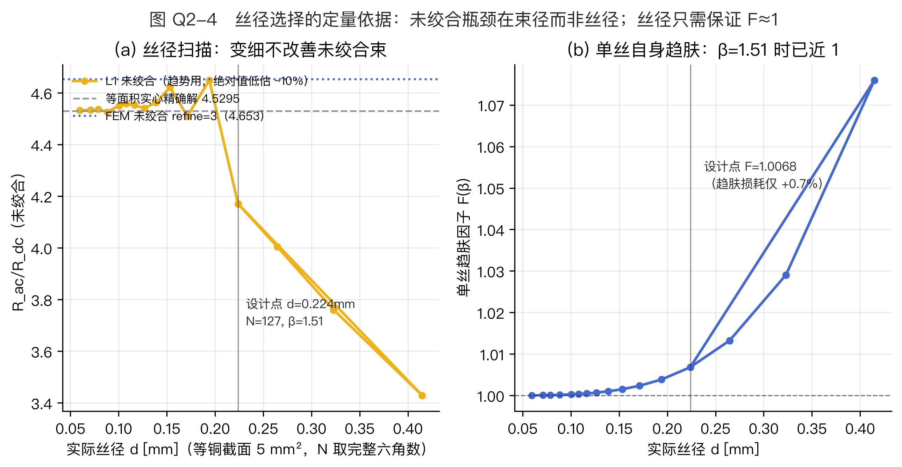
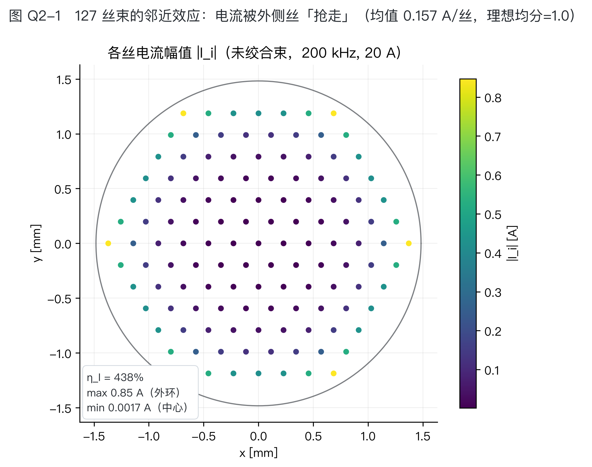
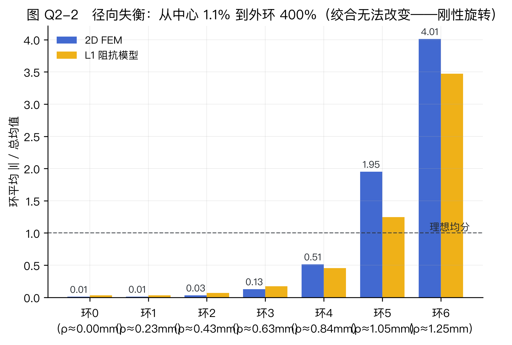
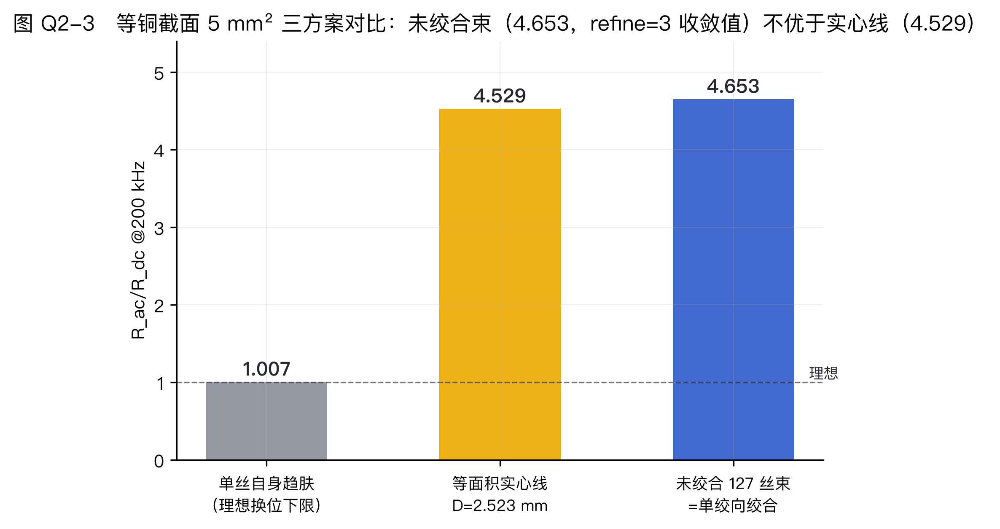
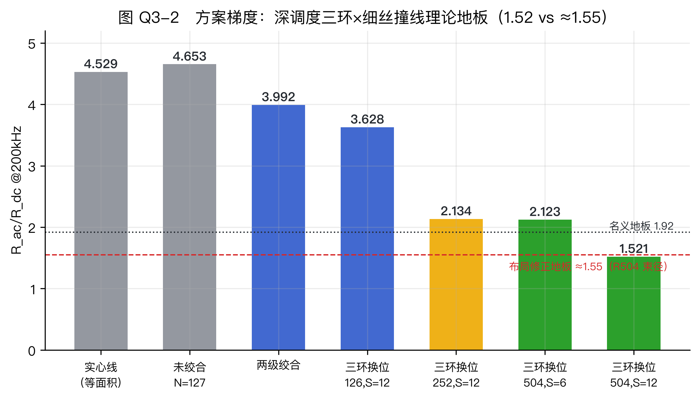
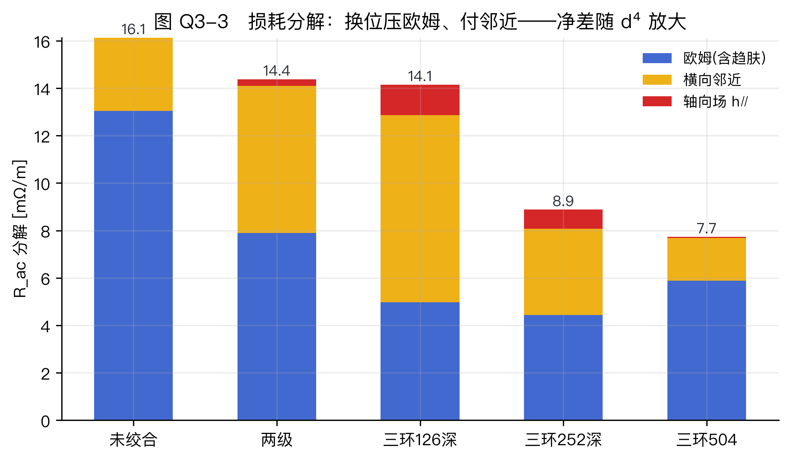

# 三维拓扑编织 Litz 线的电磁优化设计
## —— 从趋肤效应仿真到「完美编织」的探索

> 队伍：[队名]　　日期：2026-09-26　　评估长度 1 m · Cu σ=5.8×10⁷ S/m · 200 kHz · 20 A(rms) · J_dc≤4 A/mm²

**摘要**：以三路独立验证的电磁仿真体系（精确 Bessel / 径向 FD / 2D FEM）为地基，我们完成实心线趋肤效应基准（R_ac/R_dc=3.647）、127 丝 Litz 束设计与股间失衡机理（未绞合 4.65 反而劣于等面积实心 4.53）、换位方案的串联合成评估（多重集定理→换位收益的正确载体→L3 PEEC 独立验证逐丝 0.02%）与「完美换位」判据（规范敏感 D + 辫群形式化 + 轮转翻面/三环拓扑族）。核心发现：换位收益 ∝ d⁴，调度深度是被忽视的第三变量；三环深调度拓扑在 d=0.1124 mm 达 R_ac/R_dc=1.52（η_I=12.4%，撞线布局修正理论地板 ≈1.55）。

**章节**：[问题一](q1.md) · [问题二](q2.md) · [问题三](q3.md) · [问题四](q4.md) · [文献吸收笔记](PAPERS_NOTES.md)

## AI 工具使用声明（赛题 2.3）

| 环节 | 工具与用途 |
|---|---|
| 文献调研 | Claude Code 多 agent 并行检索/精读（9 篇全文，paper/refs/）；OpenAlex/CrossRef 元数据核验 |
| 代码开发 | Claude Code 编写全部仿真/几何/判据脚本（人工复核 + 独立基准交叉验证） |
| 仿真运行与数据 | 全部数值由本地脚本真实计算（.venv，可复现命令见各章证据清单）；AI 未生成任何仿真数据 |
| 质量控制 | 对抗审计 workflow（数值逐位核对）×多轮；4 处公式转录错误由独立基准/审计发现并修正（findings H+13/H+19） |
| 网站与文档 | Claude Code 生成 web/ 站点与各章初稿，人工终审 |

## 提交清单核对（赛题表 4）

| # | 材料 | 状态 |
|---|---|---|
| 1 | 论文 PDF（四章+摘要+AI 声明） | ✅ 四章审计闭环 + 终审反幻觉审查（复跑 5/5 复现） |
| 2 | 仿真证据包（云图/J(r)/Rac + 工程文件） | ✅ data/ + paper/figures/ + 脚本 + findings.md（26 条） |
| 3 | 几何模型源文件（参数化脚本） | ✅ geo/ + q2_litz/ + q3_braid/ |
| 4 | 展示网站 URL + 源码 | 🔶 web/ 就绪（真实拓扑 demo）+ 部署管线；待 Settings→Pages 启用 |
| 5 | AI 使用声明 | ✅ 上表 |

# 问题一　一根实心导线的高频仿真

## 1　问题重述与求解路线

问题一要求对直径 $D=2\ \mathrm{mm}$、长 $1\ \mathrm{m}$ 的实心圆铜导体建立涡流场仿真模型（激励 $20\ \mathrm{A_{rms}}$、$200\ \mathrm{kHz}$），完成趋肤深度计算、电流密度分布与交流电阻提取，并验证电流集中层厚度与网格收敛性。针对评分强调的「流程走通、数据真实可信」，本文采用**三条相互独立的路线**交叉验证，任务与路线对应如下（表 Q1-1）：

| **表 Q1-1** 原题任务 | 本文路线 | 章节与主要证据 |
|---|---|---|
| ① 由式 (1) 推导并计算 $\delta(200\,\mathrm{kHz})$ | 符号推导＋代入数值 | §2；`data/q1_results.json` |
| ② 建立 2 mm / 1 m 涡流场仿真模型 | 2D 有限元（scikit-fem，主路线）；径向有限差分、精确 Bessel 解（校核路线） | §3；`q1_solid/fem2d_skfem.py`、`q1_solid/radial_fd.py` |
| ③ 云图、$J(r)$ 曲线、$R_{ac}$ 与 $R_{ac}/R_{dc}$ | 图 Q1-1/Q1-2、表 Q1-2/Q1-3 | §4；`paper/figures/`、`data/*.csv` |
| ④ 层厚一致性、网格影响与收敛性 | 图 Q1-3/Q1-5、表 Q1-4/Q1-5 | §5；`data/q1_results.json` |

三条路线为：(i) **精确 Bessel 解** $Z_{\mathrm{int}}=k\rho J_0(ka)/(2\pi a J_1(ka))$，$k=(1+\mathrm{j})/\delta$；(ii) **径向有限差分**（三对角复对称方程组）；(iii) **2D 有限元**（$A$–$v$ 公式）。三者仅共享材料参数（`sim/constants.py`），数值上彼此独立。

## 2　任务一：趋肤深度推导与计算

良导体（$\omega\epsilon\ll\sigma$）中纵向电场满足扩散型 Helmholtz 方程，其解沿深度 $x$ 按 $E\propto\mathrm{e}^{-(1+\mathrm{j})x/\delta}$ 衰减，幅值降至表面 $1/e$ 的深度由式 (1) 给出：

$$\delta=\sqrt{\frac{2}{\omega\mu\sigma}}=\sqrt{\frac{\rho}{\pi f\mu}},\qquad \rho=\frac{1}{5.8\times10^{7}}=1.724\times10^{-8}\ \Omega\cdot\mathrm{m},\ \ \mu=\mu_0=4\pi\times10^{-7}\ \mathrm{H/m}.$$

代入 $f=200\ \mathrm{kHz}$：

$$\delta=\sqrt{\frac{1.724\times10^{-8}}{\pi\times2\times10^{5}\times4\pi\times10^{-7}}}=1.4777\times10^{-4}\ \mathrm{m}=147.77\ \mu\mathrm{m}$$

（`data/q1_results.json: delta_um = 147.7717`）。此时 $a/\delta=6.77$，导体直径约为 $\delta$ 的 13.5 倍，趋肤效应显著；同一公式给出扫频各频点 $\delta(f)$（表 Q1-3，`data/q1_sweep.csv`）。

## 3　任务二：仿真模型（求解器设置与网格策略）

本队使用非 ANSYS 的开源工具链，按赛题 2.2 要求说明如下。$1\ \mathrm{m}$ 导体几何与场沿轴向均匀，故取**单位长度二维横截面相量模型**（磁准静态，$\mathrm{e}^{\mathrm{j}\omega t}$，全部有效值）：所求 $R_{ac}$、$P$ 均为每米量，乘以 $1\ \mathrm{m}$ 即得整段导体数值（评估长度，`sim/constants.py: LENGTH`）。

**控制方程与弱式。** 以磁矢位 $A_z$ 与标量位 $v$ 表示 $E_z=-(\mathrm{j}\omega A_z+v)$，$J_z=\sigma E_z$。在铜盘＋空气域 $\Omega$ 上求 $(a,v)\in H^1_0\times\mathbb{R}$：

$$\frac{1}{\mu}\int_{\Omega}\nabla a\cdot\nabla w\,\mathrm{d}x-\mathrm{j}\omega\sigma\int_{\mathrm{Cu}}aw\,\mathrm{d}x-\sigma v\int_{\mathrm{Cu}}w\,\mathrm{d}x=0,$$

$$\mathrm{j}\omega\sigma\int_{\mathrm{Cu}}a\,\mathrm{d}x+\sigma A_{\mathrm{Cu}}\,v=-I .$$

第二式为**总电流约束的拉格朗日乘子行**（$I=20\ \mathrm{A_{rms}}$），替代端口激励；外边界 $A_z=0$，截断于 $r=30a=30\ \mathrm{mm}$。该装配为**复对称（不共轭）**形式，与 MQS 涡流场一致；求解器内置直流极限自检（$v=-I/(\sigma A_{\mathrm{Cu}})$ 时 $Z\to R_{dc}$ 精确成立）。

**求解器与网格策略。** 有限元：scikit-fem，三角 **P2 单元**（4 阶积分），scipy 稀疏直接解；$R_{ac}$ 用双口径提取（$P/I^2$ 与 $\mathrm{Re}[Z]=\mathrm{Re}[-v/I]$）互检。网格：gmsh 距离场加密（Frontal-Delaunay），表面**目标**单元尺寸 $0.45\delta=66.5\ \mu\mathrm{m}$（refine=1；实测中位 $\approx91\ \mu\mathrm{m}<\delta$，生产 refine=2 目标 $\approx33\ \mu\mathrm{m}$），经 $15\delta$ 过渡到 $3\ \mathrm{mm}$；meshio 桥接读入，铜/空气按单元质心几何分类（避免标签错位，见 `sim/gmsh_mesh.py`、`q1_solid/fem2d_skfem.py` 文档字符串）。单次求解亚秒级（refine=1/2/4 实测 0.2/0.3/0.8 s，见 `q1_solid/fem2d_skfem.py` 运行输出）。网格示意见图 Q1-5。校核路线：径向 FD 对 $(1/r)\,\mathrm{d}(r\,\mathrm{d}E_z/\mathrm{d}r)/\mathrm{d}r=\mathrm{j}\omega\mu\sigma E_z$ 作有限体积离散，边界 $\mathrm{d}E_z/\mathrm{d}r|_{a}=\mathrm{j}\omega\mu I/(2\pi a)$、轴心对称，$N=2048$。

**图 Q1-5**　网格策略（refine=1 基准网格）：距表面距离场加密，表面目标 $0.45\delta=66.5\ \mu\mathrm{m}$（实测中位 $60$–$110\ \mu\mathrm{m}$（口径依赖）），逐层过渡到 3 mm。

## 4　任务三：结果

**电流密度分布（图 Q1-1、Q1-2）。** 云图（顶点插值渲染）定性显示电流集中于表面薄层；定量取高分辨剖面：表面 $|J_z|=3.165\times10^{7}\ \mathrm{A/m^2}=31.7\ \mathrm{A/mm^2}$，轴线处 $2.80\times10^{5}\ \mathrm{A/m^2}=0.28\ \mathrm{A/mm^2}$，相差约 **113 倍**，与云图标尺一致；相位从轴线 $38.2^\circ$ 变到表面 $42.8^\circ$（`data/q1_J_r.csv` 首末行）。三法 $J(r)$ 曲线在图 Q1-2(a) 中重合——表面值 FD $3.1651\times10^7$ 与精确 Bessel $3.1602\times10^7$ 仅差 $-0.15\%$（`data/q1_jr_allmethods.csv` 末行）。等截面直流基准 $J_{dc}=6.37\ \mathrm{A/mm^2}$（$20\,\mathrm{A}/\pi\,\mathrm{mm^2}$）。注：题面任务②指定 $D=2$ mm，其 $J_{dc}$ 高于表 1 温升约束 $4\ \mathrm{A/mm^2}$——该约束自问题二起约束设计（最小铜截面 $5\ \mathrm{mm^2}$，等效实心 $D=2.523$ mm），本题按题面固定几何执行。

**图 Q1-1**　横截面 $|J_z|$ 云图及表层放大（FEM，$D=2$ mm，200 kHz，20 A）。数据：FEM 求解器现场输出。

**图 Q1-2**　(a) 径向 $J(r)$ 三法对比；(b) 表层归一化衰减与 1/e 深度。数据：`data/q1_J_r.csv`、`data/q1_jr_allmethods.csv`。

**交流电阻。** $R_{dc}=\rho/(\pi a^2)=5.488\ \mathrm{m\Omega/m}$，三法结果如下（200 kHz）：

**表 Q1-2**　$R_{ac}/R_{dc}$ 三法对比（`data/q1_results.json`、`findings.md`）

| 方法 | $R_{ac}/R_{dc}$ | 相对精确解偏差 |
|---|---|---|
| 精确 Bessel 解 | 3.64720 | — |
| 径向 FD（N=2048） | 3.64726 | +0.0016% |
| 2D FEM（refine=2，14 810 dof） | 3.6487 | +0.041% |

FEM 双口径 $R_{ac}=P/I^2=20.026\ \mathrm{m\Omega/m}$ 与 $\mathrm{Re}[-v/I]$ 一致到 0.01 m$\Omega$（`findings.md`）；损耗 $P=8.010\ \mathrm{W/m}$（`data/q1_results.json`，refine=4 网格——表 Q1-2 的代表值取 refine=2，头条数值以 refine=4 复核给出，评委可用 $20.026/5.488=3.6490$ 复算对应表 Q1-5 第 4 行）。频率扫描（图 Q1-4、表 Q1-3）：

**表 Q1-3**　频率扫描（`data/q1_sweep.csv`；FEM 列 `data/q1_results.json: sweep_fem`，refine=1 逐频点网格）

| $f$ [kHz] | $\delta$ [µm] | 精确解 | FD (N=2048) | FEM | $L_{int}$ [nH/m] |
|---|---|---|---|---|---|
| 50 | 295.5 | 1.96597 | 1.96603 | 1.97102 | 29.06 |
| 100 | 209.0 | 2.66163 | 2.66170 | 2.66563 | 20.73 |
| 200 | 147.8 | 3.64720 | 3.64726 | 3.65089 | 14.76 |
| 500 | 93.5 | 5.60864 | 5.60867 | 5.61965 | 9.38 |
| 1000 | 66.1 | 7.82213 | 7.82209 | 7.86604 | 6.65 |

内电感 $L_{\mathrm{int}}(f)$ 列取自 FD（`data/q1_sweep.csv`）：随频率升高、$\delta$ 收缩而减小，自直流极限 $\mu_0/8\pi=50$ nH/m 向高频小值过渡（200 kHz 为 14.76 nH/m），符合趋肤深度收缩的物理预期。本扫描对应统一工况表 1「鼓励 50 kHz–1 MHz 频率扫描」的附加验证项。

**图 Q1-4**　频率扫描 50 kHz–1 MHz：(a) $R_{ac}/R_{dc}$ 三法；(b) $\delta(f)$。

## 5　任务四：验证与讨论

**① 电流集中层厚度。** 由 FD 曲线（N=2048）提取 $|J|$ 降至表面值 $1/e$ 的深度为 **161.2 µm**（`data/q1_results.json: e_fold_depth_um`），与理论 $\delta=147.8\ \mu\mathrm{m}$ 同量级、偏大约 9%。偏差原因：$\delta$ 来自平面半无限导体解的纯指数衰减，而圆柱精确剖面 $J(r)=J(a)J_0(kr)/J_0(ka)$ 为复 Bessel 函数，其**幅值包络并非纯指数**且含径向相位分布（相位沿径向 38.2°→42.8°，`data/q1_J_r.csv` 首末行），故幅值 1/e 深度略大于 $\delta$，二者一致性成立。

**② 表层网格密度的影响与收敛性（图 Q1-3）。** FD 收敛表如下（`data/q1_results.json: fd_conv`，粗网格为系统性低估）：

**表 Q1-4**　径向 FD 网格收敛（200 kHz；误差为绝对值，$N\le128$ 档带符号为负——系统性低估）

| N | 16 | 32 | 64 | 128 | 256 | 512 | 1024 | 2048 |
|---|---|---|---|---|---|---|---|---|
| 误差 [%] | 4.29 | 0.96 | 0.20 | 0.035 | 0.0013 | 0.0034 | 0.0027 | 0.0016 |

相邻加密档误差比约 4–6，符合二阶格式 $O(h^2)$；$N\ge128$（径向步长 $h=a/127\approx7.9\,\mu$m $\approx\delta/19$）误差已低于 0.04%，$N\ge256$ 进入 10⁻³% 量级的数值噪声平台。FEM 收敛（`data/q1_results.json: fem_conv`；比值见 `findings.md`）：

**表 Q1-5**　FEM 网格收敛（200 kHz）

| 加密级别 | 自由度 | $R_{ac}/R_{dc}$ | 误差 [%] |
|---|---|---|---|
| refine=1 | 8 638 | 3.6509 | 0.101 |
| refine=2 | 14 810 | 3.6487 | 0.041 |
| refine=4 | 32 590 | 3.6490 | 0.049 |

FEM 误差由 0.10% 降至 0.04% 后进入平台，继续加密收益边际递减。结论：表层单元尺寸 $\le\delta$（本文目标 $0.45\delta$，实测 $\approx91\ \mu$m $<\delta$）即可将误差压至约 0.1%，推荐 refine=2 作为生产设置；更密的网格只带来约 0.05% 的平台内波动。

**图 Q1-3**　网格收敛性：FD 呈二阶斜率，FEM 误差 0.10%→0.04% 平台。

**③ 三法交叉验证。** 全部 5 个频点上 FD 与精确解偏差 $\le0.0031\%$，FEM 与精确解偏差 $\le0.57\%$（1 MHz 最大 0.561%，200 kHz 为 0.10%）；FEM 的 $P/I^2$ 与 $\mathrm{Re}[-v/I]$ 双口径一致到 0.01 mΩ，且通过直流极限自检。三条独立路线的闭环一致表明结果是真实可信的。

**④ 局限。** ①空气域截断于 30a——已复核：截断半径 30a→60a 时 $R_{ac}/R_{dc}$ 变化 $<1\times10^{-4}\%$（refine=2 复算，`data/q1_mesh_air30/60.msh`），影响可忽略；②P2 单元对表层陡峭剖面仍存在离散误差（表 Q1-5 平台的主要来源）；③轴向均匀假设忽略 1 m 导体端部效应（$1\ \mathrm{m}\gg2a=2$ mm，端部影响限于 $\delta$ 量级区域）；④FEM 的 P2 径向采样插值在早期版本曾退化为常数列（已修复）；当前 `data/q1_fem_J_r.csv` 为正常导出（即图 Q1-2(a) 的 FEM 曲线，表面 $3.190\times10^7$，较 FD +0.8%），1/e 深度仍取已验证的 FD 曲线以保守。

## 6　证据清单

| 结论 | 证据（图/数据/脚本） |
|---|---|
| $\delta=147.77\ \mu$m 及 $\delta(f)$ | `data/q1_results.json`（delta_um）、`data/q1_sweep.csv` |
| $J(r)$ 曲线、表面/轴线 $|J|$、相位 | `data/q1_J_r.csv`、`data/q1_jr_allmethods.csv` |
| 截面云图（任务③） | `paper/figures/q1_fig1_contour.png` |
| 1/e 深度 161.2 µm | `data/q1_results.json`（e_fold_depth_um）、图 Q1-2 |
| 三法 $R_{ac}/R_{dc}$、扫频（表 Q1-2/3） | `data/q1_results.json`（ratio_*、sweep_*）、`data/q1_sweep.csv`、`findings.md` |
| $R_{ac}=20.026$ mΩ/m、$P=8.010$ W/m、$R_{dc}=5.488$ mΩ/m | `data/q1_results.json`（rac_fem_mohm_per_m、p_loss_w_per_m、rdc_mohm_per_m） |
| 网格收敛（表 Q1-4/5） | `data/q1_results.json`（fd_conv、fem_conv）、图 Q1-3 |
| 网格策略与求解器设置 | 图 Q1-5、`sim/gmsh_mesh.py`、`q1_solid/fem2d_skfem.py` |
| 复现工程文件与顺序 | `./.venv/bin/python q1_solid/radial_fd.py` → `q1_solid/fem2d_skfem.py` → `q1_solid/truncation_check.py` → `q1_solid/make_figs.py`（依次产出 `data/` 与 `paper/figures/` 全部文件）；环境 Python 3.12.7 + numpy 2.5.3 / scipy 1.18.1 / scikit-fem 12.0.2 / gmsh 4.15.2 / meshio 5.3.5 / matplotlib 3.11.2 |

（注：1/e 深度提取不依赖 `data/q1_fem_J_r.csv`（取自 `data/q1_J_r.csv`）；前者即图 Q1-2(a) 的 FEM 曲线数据。）

# 问题二　设计你的第一根 Litz 线：约束、结构、仿真与股间失衡

## 1　问题重述与设计决策链

问题二要求在 $20\ \mathrm{A_{rms}}$、$200\ \mathrm{kHz}$、$J\le4\ \mathrm{A/mm^2}$ 工况下设计第一根 Litz 线：① 确定丝径 $d$（与趋肤深度 $\delta$ 的定量关系）、丝数 $N$ 与总铜截面；② 给出细丝排布与成束方式并程序化建模；③ 仿真提取电流分布与 $R_{ac}/R_{dc}$，与问题一等截面实心导体对比；④ 讨论股间电流不均及机理。本文的量化决策链为：

$$J\le4 \;\Rightarrow\; A_{cu}=5.000\ \mathrm{mm^2} \;\Rightarrow\; N=127\ (\text{完整六角环}) \;\Rightarrow\; d=0.2239\ \mathrm{mm} \;\Rightarrow\; \beta=d/\delta=1.515,\ F(\beta)=1.0068 \;\Rightarrow\; \text{束 }OD=2.969\ \mathrm{mm}$$

**表 Q2-1**　任务 ↔ 章节 ↔ 证据

| 原题任务 | 章节 | 主要证据 |
|---|---|---|
| ① 设计约束与选型 | §2 | `data/q2_q3_baseline.json`、`data/q2_tradeoff.csv/json`、图 Q2-4 |
| ② 结构设计与程序化建模 | §3 | `geo/strand_packing.py`、`data/q2_strand_centers.csv`、`q2_litz/solve_bundle.py` |
| ③ 仿真、电流分布、$R_{ac}/R_{dc}$、实心对比 | §4 | 图 Q2-1/2/3、`data/q2_convergence.csv`、`data/q2_strand_currents.csv` |
| ④ 股间不均观察与机理 → 引出问题三 | §5 | `data/q2_strand_currents.csv`、`findings.md`、`data/q2_tradeoff.json` |

## 2　任务一：设计约束与丝径/丝数选型

**约束链逐步定量。** (i) $A_{cu}=I/J=20/4=5.000\ \mathrm{mm^2}$（精确值，`data/q2_q3_baseline.json: design.a_cu_exact_mm2`）。(ii) 取 $N=127=3k(k{+}1)+1$（$k{=}6$），即完整六角环 0–6、丝数 $1{+}6{+}12{+}18{+}24{+}30{+}36$（`data/q2_ring_currents.csv: count` 列）——完整环保证 6 重旋转对称下**同轨道（同半径组）**丝严格等价（每环含 1–3 条半径轨道），电流失衡以径向结构为主，环统计才有确定含义（`geo/strand_packing.py`；`findings.md` H+7）。(iii) 反解丝径 $d=2\sqrt{A_{cu}/(N\pi)}=0.2239\ \mathrm{mm}$，$\beta=d/\delta=1.515$（$\delta=147.77\ \mu$m），孤立丝精确 Bessel 趋肤因子 $F(\beta)=1.00682$——单丝自趋肤代价仅 $+0.7\%$，可忽略（`data/q2_q3_baseline.json: skin`）。(iv) 束外径 $OD=2.969\ \mathrm{mm}$，铜填充率 $72.2\%$（工程常见量级；六方密排上限 $90.7\%$），$R_{dc}=\rho/A_{cu}=3.448\ \mathrm{m\Omega/m}$（`data/q2_results.json`、`data/q2_tradeoff.json: design_point`、`geo/strand_packing.py`）。

**丝径权衡扫描（36 点，$d\in[0.06,0.40]$ mm，$A_{cu}$ 恒 5 mm²，图 Q2-4、`data/q2_tradeoff.csv`）给出反直觉结论：未绞合束的比值随 $d$ 变细不降反升**——粗端 $N{=}37$/$d{=}0.415$ mm 为 3.43，设计点 4.17，$d\le0.171$ mm 后进入 $\pm1.2\%$ 平台（4.51–4.62，判据 max−min<3%，`q2_tradeoff.json: flat_criterion`），最细 $N{=}1801$ 时 4.5326，恰收敛于等铜面积实心导体的精确值 4.5295（`data/q2_tradeoff.json: trend`）。机理：电流挤占由**束径**决定（全扫描 $OD\in[2.757,2.969]$ mm，$D/\delta\approx18.7$–20.1，由同表 OD 列与 $\delta$ 换算），与丝径无关；失衡指标恒在 3.19–4.63 倍（同表 `imbalance_L1` 列）。故 $d$ 的选型依据**不是「越细越好」，而是保证 $F(\beta)\approx1$**。

**弃选说明。** $d=0.2$ mm 时 $N_{exact}=159.2$ 非完整六角环数（邻近完整环需 $N{=}169$、$d{=}0.194$ mm），残缺外环破坏对称性（`data/q2_tradeoff.csv` $d{=}0.2$ 行；`findings.md` H+7）；工业丝径端 0.06–0.07 mm 对应 $N=1261$–1801（`data/q2_tradeoff.csv` 前两行），逐丝多导体 FEM 规模不可解，且扫描已证明无益（该端 $F=1.00003$–1.00007，比值停在 4.53 平台）。

**诚实性声明（L1 口径）。** 扫描用 L1 丝状阻抗模型，绝对值系统性偏低约 10%（设计点 4.171 vs FEM 4.65–4.68），且偏差随 $\beta$ 增大——粗端（$N{=}37/61$，$\beta=2.81/2.19$）仅作趋势参考，**不得**读作「粗丝更好」（`data/q2_tradeoff.json: notes、argmin_ratio_L1.caveat`）。

**图 Q2-4**　(a) 丝径扫描：未绞合比值随 $d$ 变细不降反升，$d\le0.171$ mm 后进入 4.51–4.62 平台、均值收敛到实心值 4.5295；(b) 单丝趋肤因子 $F(\beta)$。数据：`data/q2_tradeoff.csv`（L1 口径，偏差声明见正文）。

## 3　任务二：结构设计与程序化建模

结构采用**同心六角完整环的简单成束**（未绞合基准，绞合作用在 §5 论证）。`geo/strand_packing.py:hex_packing` 程序化生成几何：六方晶格布点＋圆域裁剪＋束半径二分使丝数恰为 $N$，丝心距 $=2r_s\times1.02$（`margin=1.02` 为漆膜留几何间隙、保证互不重叠），全过程确定性无随机数；输出 `data/q2_strand_centers.csv`（127 丝圆心坐标）。

**求解器为问题一 $A$–$v$ 公式的多导体推广**（`q2_litz/solve_bundle.py`）：并联丝束两端共源 → 全束共享**单一**每米压降未知量 $v$，$E_z=-(\mathrm{j}\omega A_z+v)$，$J_z=\sigma E_z$；拉格朗日乘子行施加总流约束 $\Sigma I_i=20\ \mathrm{A}$。于是逐丝电流 $I_i=-\sigma(\mathrm{j}\omega\int_{s_i}A\,\mathrm{d}A+vA_{s_i})$ 从场解**自然涌现**，外层丝偏载无需任何人为设定。网格沿用 Q1 的 gmsh 距离场加密，$h_{\min}=\min(0.45\delta,\,0.36r_s)/\text{refine}$（既分辨趋肤层又保证每丝直径 ≥5 单元，`sim/gmsh_mesh.py: make_bundle_mesh`）。

**求解器与网格策略**（按赛题 2.2）：scikit-fem 三角 **P2** 单元（4 阶积分）+ SciPy 稀疏直接解（复对称装配）；外边界 $A_z=0$，截断于 $r_{air}=10R_{bundle}\approx14.9$ mm（$\approx101\delta$；束径远大于 Q1 导线，故截断半径从 Q1 的 30a 改按束径倍数取）；gmsh Frontal-Delaunay、全部丝边界距离场加密（DistMax=$20\delta$，$h_{min}=\min(0.45\delta,0.36r_s)$/refine，每丝直径 ≥5 单元）、meshio 桥接、质心几何分类。截断复核：$r_{air}$ 10R→20R 时 ratio 变化 $-0.0007\%$（refine=2，`data/q2_richardson_truncation.json`），可忽略。$margin=1.02$ 对应丝面间隙 $\approx4.5\ \mu$m（漆膜量级）。

参数化脚本链：`geo/strand_packing.py` → `q2_litz/solve_bundle.py`（FEM 主解）→ `q2_litz/refine3.py`（收敛与基准固化）→ `q2_litz/impedance_model.py`（L1 解析交叉验证）→ `q2_litz/tradeoff_scan.py`（选型扫描）→ `q2_litz/make_figs.py`（成图）。

## 4　任务三：仿真结果

**头条：$R_{ac}/R_{dc}=4.6527$**（refine=3 raw，$R_{ac}=16.044\ \mathrm{m\Omega/m}$），序列单调下降、末两级差 0.11%；Richardson 外推（raw）4.648–4.651（Aitken 4.6514 / 三点拟合 $p{=}1.87$ 得 4.6482，`data/q2_richardson_truncation.json`——单调下降序列的外推必小于末项，保守记 **≈4.65**）。

**表 Q2-2**　三方案对比（等铜截面 $5\ \mathrm{mm^2}$、200 kHz；`data/q2_q3_baseline.json`）

| 方案 | $R_{ac}/R_{dc}$ | 出处 |
|---|---|---|
| 孤立单丝（理想换位下限） | 1.0068 | `skin.strand_skin_factor_F` |
| 等面积实心线 $D=2.523$ mm | 精确 4.5295 / FEM 4.5310（+0.03%） | `solid_equal_area` |
| 未绞合 127 丝束（＝单绞向绞合） | **4.6527**（收敛值） | `data/q2_convergence.csv` |

注（双基准策略，`findings.md` H+5 / `paper/q1.md` §4 注）：题面问题一的 2 mm 线（$R_{ac}/R_{dc}=3.647$）铜截面仅 $3.14\ \mathrm{mm^2}$、$J_{dc}=6.37>4$（该约束自 Q2 起生效）、$R_{dc}$ 口径不可比，故等截面对比基准取 $D=2.523$ mm。

未绞合束比实心**差 $+2.7\%$**（raw 口径 4.6527/4.5295=+2.72%；Richardson ≈4.65 口径 +2.6~2.7%；面积修正口径 +3.1%——三种口径并列报告，`data/q2_convergence.csv`）。

**表 Q2-3**　网格收敛（`data/q2_convergence.csv`、`data/q2_q3_baseline.json: bundle_convergence`）

| refine | dof | $A_{mesh}$ [mm²] | ratio(raw) | ratio(面积修正) | $\eta_I$ | $\Sigma I$ [A] |
|---|---|---|---|---|---|---|
| 1 | 27 553 | 4.8869 | 4.6833 | 4.7917 | 437.7% | 20.000 |
| 2 | 72 645 | 4.9654 | 4.6578 | 4.6903 | 440.3% | 20.000 |
| 3 | 136 133 | 4.9816 | 4.6527 | 4.6699 | 440.8% | 20.000 |

面积修正 $=R_{ac}^{raw}\cdot(A_{exact}/A_{mesh})/R_{dc}^{exact}$，消除网格圆化亏面积（`q2_litz/refine3.py` 头注）；$\Sigma I$ 全级精确、双口径（$P/I^2$ 与 $\mathrm{Re}[v]/I$）一致。

**电流分布（图 Q2-1、Q2-2）。** 逐丝 $|I|$ 从中心丝 0.0017 A 到外层角丝 0.85 A；refine=3 口径 $i_{min}=0.00156\approx0.010\times$均值、$i_{max}=0.8517\approx5.41\times$均值（`data/q2_q3_baseline.json`），逐丝表为 refine=1 口径（`data/q2_strand_currents.csv`）。按**构造六角环距**聚类（表 Q2-4）：

**表 Q2-4**　环平均 $|I|$/总均值（`data/q2_strand_currents.csv` 按 `ring_radii` 复算）

| 环号 | 0 | 1 | 2 | 3 | 4 | 5 | 6 |
|---|---|---|---|---|---|---|---|
| FEM | 0.011 | 0.013 | 0.033 | 0.098 | 0.312 | 1.017 | **3.37** |
| L1 | 0.032 | 0.032 | 0.068 | 0.172 | 0.456 | 1.246 | **3.47** |

环 6 两法偏差 $+3.1\%$；内外丝电流相位差约 60°（中心丝 +46.2° vs 环 6 复电流矢量平均 −14.4°，同文件复算）。注：图 Q2-2 蓝柱与 L1 柱同用六角环聚类（`ring_radii`，与表 Q2-4 同口径）；半径聚类视角下最外组（18 根靠角丝）均值 4.0×，系六角环并非等半径圆所致。

**L1 全束交叉验证。** $\mathrm{Re}Z/R_{dc}=4.1706$ vs FEM 4.65–4.68，偏低 10.4%（L1 无邻近反应项）——L1 定位为趋势与机理工具，不作绝对值依据（`data/q2_q3_baseline.json: L1_filament_untwisted`）。

**图 Q2-1**　127 丝 $|I_i|$ 着色：电流被外侧丝「抢走」（均值 0.157 A/丝）。数据：`data/q2_strand_currents.csv`。

**图 Q2-2**　径向失衡：中心 1.1% → 最外环均值 3.37×（半径聚类最外组 4.0×、角丝 5.38×）（FEM vs L1）。数据：`data/q2_strand_currents.csv`（聚类口径见表 Q2-4 注）。

**图 Q2-3**　等铜截面三方案：未绞合束（4.653，refine=3 收敛值）不优于实心线（4.5295）。数据：`data/q2_q3_baseline.json`、`data/q2_convergence.csv`。

## 5　任务四：讨论

**(1) 各丝电流均匀吗？——严重不均，且是系统性的径向梯度。** $\eta_I=(|I|_{max}-|I|_{mean})/|I|_{mean}\approx438\%$（`data/q2_strand_currents.csv`；refine=3 为 440.8%）；中心丝近乎不导电（0.010×），环电流从中心 0.011×单调升到最外环（36 丝）平均 3.37×、其中 6 根真角丝达 5.38×（$i_{max}=5.41\times$，refine=3；表 Q2-4）。机理为**电感性再分配**：并联丝共享同一 $v$，外层丝链通的内部磁通少 → 自感小 → 阻抗低 → 抢流；等效于束级「空管效应」——束半径 1.484 mm 大于等面积实心的 1.262 mm（$D=2.523$ mm 之半），且整束铜填充率仅 72.2%（外缘丝间留漆膜间隙），电流被推到更大半径、有效载流层反而更薄。换算成丝内电流密度：角丝 $\approx0.852\ \mathrm{A}/0.0394\ \mathrm{mm^2}\approx21.6\ \mathrm{A/mm^2}$（设计均值 4.0 的 5.4 倍），中心丝仅 $\approx0.04\ \mathrm{A/mm^2}$——$J\le4$ 的直流设计约束在未绞合交流工况下被局部破坏，进一步支持换位必要性。这正是未绞合束比实心差 +2.7%（raw 口径，见 §4 三口径）的原因（`findings.md` H+7/H+10/H+13）。

**(2) 绞合能救吗？——单绞向规则绞合不能。** 单绞向绞合中每丝以固定半径匀速换方位，是**刚性旋转**：丝间相对位置不变，内部互感网络与未绞合全同，故电流分配不变；长度因子 $1/\cos\alpha$ 对 $R_{ac}$ 与 $R_{dc}$ 同乘，比值几乎不变（<±2%）。此结论是对本队早先「方位角平均」建模的勘误（`findings.md` H+8；`data/q2_q3_baseline.json: notes`）——该平均模型仅适用于外场或多级换位情形，保留供问题三使用。

**(3) 引出问题三。** 丝径扫描证明：未绞合（含单绞向绞合）束趋同实心值（平台 4.51–4.62 vs 本设计 4.65），丝径只负责 $F(\beta)\approx1$；要把 3.2–4.6× 的径向失衡抹平、逼近 1.0068 的理想换位下限，唯一出路是让丝**真实交换径向位置**——径向换位/三维编织，即问题三的设计对象（`data/q2_tradeoff.json: headline_finding`）。

## 6　证据清单

| 结论 | 证据（图/数据/脚本） |
|---|---|
| $A_{cu}=5.000$、$N=127$、$d=0.2239$、$OD=2.969$、填充 72.2%、$R_{dc}=3.448$ | `data/q2_q3_baseline.json`、`data/q2_results.json`、`data/q2_tradeoff.json`、`geo/strand_packing.py` |
| $\beta=1.515$、$F=1.00682$、$\delta=147.77\ \mu$m | `data/q2_q3_baseline.json: skin` |
| 丝径扫描 36 点、变细不降反升、平台 4.53≈实心、失衡 3.19–4.63 | `data/q2_tradeoff.csv`、`data/q2_tradeoff.json`、图 Q2-4 |
| 头条 4.6527（Richardson raw 4.648–4.651）、实心 4.5295/4.5310、束差 +2.7%（raw）~+3.1%（面积修正）、截断 −0.0007% | `data/q2_convergence.csv`、`data/q2_richardson_truncation.json`、`findings.md` H+10/H+13 |
| 逐丝/环电流、$\eta_I$、环 6 FEM↔L1 +3.1%、角丝 5.38× | `data/q2_strand_currents.csv`、图 Q2-1/Q2-2、`q2_litz/impedance_model.py` 现算（表 Q2-4；`data/q2_ring_currents.csv` 仅用其 count 列，电流列为方位角平均参考模型） |
| L1 4.1706（偏低 10.4%）与适用域声明 | `data/q2_q3_baseline.json: L1_filament_untwisted`、`data/q2_tradeoff.json: notes` |
| 刚性旋转论证（单绞向不改分配） | `findings.md` H+8、`data/q2_q3_baseline.json: notes` |
| 几何/网格/求解器与复现 | `geo/strand_packing.py`、`sim/gmsh_mesh.py`、`q2_litz/solve_bundle.py`、`data/q2_bundle_r1/2/3.msh`、`data/q2_solid_eq_r1/2.msh`；复现顺序 `./.venv/bin/python geo/strand_packing.py` → `q2_litz/solve_bundle.py` → `refine3.py` → `tradeoff_scan.py` → `truncation_check.py` → `make_figs.py` |

# 问题三　编织方案的仿真调优：方法学、方案梯度与 L3 独立验证

## 1　问题重述与方法学路线

问题三要求在等总铜截面（$5\ \mathrm{mm^2}$）、等频率（$200\ \mathrm{kHz}$）、等激励（$20\ \mathrm{A_{rms}}$）约束下，以 $R_{ac}/R_{dc}$ 最小化为核心，参数化编织方案、建立「参数 → 三维几何 → 电磁仿真 → 指标评估 → 修改参数」闭环，比较至少 3 种本质不同的换位/编织方案，给出最优方案、敏感性分析与调优记录。本队的方案宇宙沿「换位彻底程度」梯度展开：**A** 未绞合（下限基线）→ **C** 两级反向绞合成缆（部分径向换位）→ **R** 轮转翻面/三环轮转族（真三维编织，径向遍历，$N{=}3\times k\times7$，$k{=}6/12/24$ 对应 $d=0.2248/0.1589/0.1124$ mm）；设计变量为 $N$、$d$（等截面联动）、编织周期与调度深度 $S$（每周期站数）。

**方法学路线（五层，全部脚本化）**：

1. **多重集定理（发现叙事）**：切片引擎首跑（`q3_braid/slice_engine.py`，约 30 s/方案）得到一个意外结果——纯置换调度（只重排站位内丝位）不改变每站的位置多重集，逐站 2D 损耗对换位原理不敏感（0.03% 验证）。定理化结论：**换位的全部收益不在逐站截面，而在串联耦合**（`findings.md` H+17）。
2. **串联合成**（`q3_braid/series_l1.py`）：以「电流沿线恒定 + 终端均压」为边值问题——对数核阻抗矩阵 $Z$ 逐站离散求和后全局求解，这是换位收益的正确载体；两个实现教训（分段插值穿越对数核奇异、排序前缀和劈开同壳包围流）已入档（H+17）。
3. **FEM 锚定 prox 标定**：邻近项以「单站 FEM 总损耗 − 解析欧姆」为参考锚定，解析 $\Sigma H^2$ 只做站间再分配的比值——绝对值不依赖解析式。
4. **闭式修正项**：长度因子 $\bar m$（逐轨道精确 $1/\cos\alpha$）与平行场损耗 $h_\parallel$（Umetani (22) 修正式，见 §4 勘误链）。
5. **L3 独立验证**：3D 细丝 PEEC 基准（`q3_braid/peec3d.py`）分层判决（§4）。

**近似层级声明**：L1 对数核（趋势/机理）＜ 2D 切片 FEM（产线口径）＜ L3 PEEC（独立基准）。本文全部绝对数字出自 FEM 锚定的串联合成口径；解析式仅以「比值 + 修正项」身份进入。

## 2　指标体系

- **主指标** $R_{ac}/R_{dc}$（题面表 2，越接近 1 越好）；
- **辅助 1** 均流偏差 $\eta_I=\sqrt{\langle(I_i-\bar I)^2\rangle}/\bar I$（串联合成口径：终端均压下整线逐丝电流的 RMS 相对偏差，`q3_braid/series_l1.py`）。**口径注（勘误）**：Q2 报告的 438% 为**单站并联口径**（FEM、N=127、最大偏差统计量），表 Q3-1 为串联口径——未绞合时各站全同，串联求解逐位退化为单站问题，两口径物理一致；A 行 1.439 与 438% 的数值差来自统计量（RMS vs 最大）与求解器/束几何（L1 对数核·126 刚性 vs FEM·127 六角），非口径矛盾；
- **辅助 2** 换位充分性 $D$（问题四判据，$D=0.5D_{dwell}+0.5D_\phi$、去旋转系，定义见 `paper/q4.md` §1）；
- **三口径同报**：每米电缆 $R_{dc}$（含 $\bar m$，IEC 60228 思路）、$R_{ac}$ 与比值并列——防止「比值好看但绝对损耗变差」的口径误导（`RESEARCH.md` 决策 5）。例（`data/q3_threering_hpar_fixed.json`）：R126 深 $R_{dc}{=}4.063\ \mathrm{m\Omega/m}$、$R_{ac}{=}14.74$、比值 3.628；R252 深 4.162 / 8.884 / 2.134；R504 3.643 / 7.734 / 2.123（未绞直线基准 $R_{dc}{=}3.448$，`data/q2_q3_baseline.json`；$R_{dc}$ 差异全由 $\bar m{=}1.178/1.207/1.056$ 解释）。

## 3　方案梯度与结果（h∥ 勘误后权威口径，`data/q3_final_summary.json`）

**表 Q3-1**　方案梯度（等铜截面 5 mm²、200 kHz；比值与辅助指标均为勘误后口径）

| 方案 | $N$ / $d$ [mm] | $R_{ac}/R_{dc}$ | 对照（刚性同几何） | $h_\parallel$ [mΩ] | $\eta_I$ | $D$ |
|---|---|---|---|---|---|---|
| 实心（等面积，Q2） | — | 4.5295 | — | — | — | — |
| A 未绞 127（Q2 FEM） | 127 / 0.2239 | 4.653 | — | — | — | — |
| A 未绞 126 刚性 | 126 / 0.2248 | 4.6756 | — | 0 | 1.439（勘误） | 0.81 |
| C 两级反向绞 | 126 / 0.2248 | **3.9916**（−14.6% vs A） | — | 0.29 | 0.714 | 0.57 |
| R126 三环深调度 $S{=}12$ | 126 / 0.2248 | **3.6282** | 3.8824（−6.5%） | 1.29 | 0.272 | 0.355 |
| R252 三环浅调度 $S{=}6$ | 252 / 0.1589 | 4.3032 | — | 0.15 | 0.674 | 0.400 |
| R252 三环深调度 $S{=}12$ | 252 / 0.1589 | **2.1344** | 3.9907（−46.5%） | 0.81 | 0.114 | 0.352 |
| R504 三环 $S{=}6$（原口径） | 504 / 0.1124 | **2.1232** | 3.7326（−43.1%） | 0.05 | 0.384 | 0.431 |
| R504 三环深调度 $S{=}12$ | 504 / 0.1124 | **1.5213（全梯度最优）** | — | 0.25 | 0.124 | 0.404 |
| Umetani 地板（$d{=}0.1124$） | — | 1.92（名义）/ ≈1.55（R504 布局修正） | — | — | — | — |

（$\eta_I$、$D$ 出处：`q3_final_summary.json: eta_I, D_values`；刚性对照 `final_gradient`；浅/深调度补全点 `data/q3_depth_completion.json`，$h_\parallel$ 由 $p_{h\parallel}/I^2$ 换算。A 行 $\eta_I$ 勘误：原表 0.439 为换算错，正确 **1.439**（`q3_series_l1.json: A_untw126/eta_I`）。$D$ 列补全口径：R252 浅调度 0.400 / R504 深调度 0.404 为 `q3_braid/multiring.py` + `q4_perfect/criterion.py` 复算（三个已发布值 0.355/0.352/0.431 逐位复现，其中 0.431 为 $S{=}6$ 口径）。）

**图 Q3-2**　方案梯度柱状图：全部换位方案（修正后）净优于未绞，细丝端逼近名义地板 1.92；R504 深调度补全点 1.5213 进一步撞线布局修正地板 ≈1.55（地板为布局依赖量，见 §5；柱状图为补全前主体方案）。数据：`data/q3_final_summary.json: final_gradient`。

**图 Q3-3**　损耗三段分解（欧姆/横向邻近/平行场 $h_\parallel$，W/m（20 A））：换位把横向邻近项从主导压到次要，$h_\parallel$ 随 $d$ 缩小坍缩。数据：`data/q3_threering_hpar_fixed.json`（R126 深 1.99/3.39/0.52 → 5.90 W/m；R252 深 1.78/1.45/0.33；R504 2.35/0.72/0.02）。

**两个反直觉结论（修正后解读）。** (i) **未绞合 ≈ 实心**：4.653 vs 4.5295（+2.7%，Q2 结论）——束径而非丝径决定电流挤占，未换位的细丝束没有意义。**排布依赖诚实注**：+2.7% 为六角排布口径；队友 COMSOL 圆形同心环排布（N=331、$d{=}0.14$ mm）的未绞束 4.40 反而**优于**实心 2.7~3.65%（`data/q2c_results.json`：我方复算 4.408 vs 实心 4.5295 为 −2.7%；队友 COMSOL 4.403 vs 其实心基准 −3.65%）——环对称消除环内失衡；但距单丝理想（≈1.001）仍 4.4×，换位结论不变。A 基线取六角刚性排布 = 与 C 同几何的严格控制变量。(ii) **粗丝下换位收益受限**：勘误前 C 两级曾判「净亏」（4.38），那是 $h_\parallel$ 公式高估 3.34× 的伪影；修正后 C 净赢 −14.6%，但 $d{=}0.2248$ 全梯度最好也只有 3.63（−22% vs A）——均流的横向邻近代价 $K\propto\gamma^4$ 与 $h_\parallel$ 在粗丝端仍吞掉大半欧姆收益；收益在细丝端爆发（R504 浅调度 2.1232 距名义地板 +10.6%；深调度 $S{=}12$ 进一步至 **1.5213**，撞线布局修正地板 ≈1.55，见 §5 与 `q4.md` §4）。

## 4　L3 独立验证（3D 细丝 PEEC）与 h∥ 勘误链

**基准**：filament PEEC（Zhang/White/Kassakian APEC2014 路线；7 丝 cage 微束，$d{=}0.2248$、$P_1{=}12.5$ mm、200 kHz、$\Sigma I{=}20$ A）。自检：共线段恒等式命中 $3\times10^{-16}$、Neumann 4×4 vs 12×12 Gauss ≤ $5.1\times10^{-7}$、功率平衡 $3.6\times10^{-16}$、离散化收敛（Np4/M48 → Np10/M80）相对差 −0.05%（`data/l3_validation.json: self_tests, peec3d_convergence`）。

**分层判决**（`l3_validation.json: verdict`）：

| 层级 | 判据 | 结果 |
|---|---|---|
| 内核（决定性） | PEEC ↔ 我方 L1 逐丝电流 | **0.024% 通过**（方向一致：中心<外） |
| vs FEM | 邻近反应层级差 | 20.3%，**MARGINAL**（允许 ≤25%；产线口径 FEM 锚定故不传导） |
| 多重集不变性 | cage/rigid 串联电流 | 逐位相等，7 丝级再证 |
| $\bar m$ 记账 | 比值口径残差 | $4.4\times10^{-16}$ |
| $\Delta$ 判据（30%） | 绞合增量对比 | **FAIL**，但全可分解（下） |
| $h_\parallel$ 公式 | Biot–Savart 场审计 | **我方式与 Umetani 原式均 FAIL** → 触发勘误 |

**$h_\parallel$ 勘误链（如实记录）**：Biot–Savart 实测中心丝 $|H_z|{=}1449\ \mathrm{A/m}$，与 6 条外丝方位电流的安培螺线管值精确命中；我方转录式 $h_s=i\,r\sin\theta/(\pi\alpha_L^2)$ 给中心 0/外丝 1432——**径向结构反转**（正确结构 = Umetani 原文 (22) $h=i(\alpha_L-r)\tan\theta/(\pi\alpha_L^2)$：中心最大、边缘为零），$\Sigma H^2$ 高 2.89×；Umetani 原式幅值亦高 1.79×（均匀电流海假设 vs 空芯 7 丝）。冲击量化：C 两级 $h_\parallel$ 1.695 mΩ（+47% $R_{dc}$）→ 修正 0.508 mΩ（+14%），高估 3.34×（片和重算的量级判定；全量复算后的正式口径 $C$ $h_\parallel{=}0.29$ mΩ，见表 Q3-1 与 `q3_final_summary.json: hpar_corrected_mOhm`）。**修正公式后全量复算**：C 4.38→3.99、R126 深 3.997→3.628、R252 2.504→2.134、R504 2.248→2.123（H+19；权威值见 `q3_final_summary.json`）。这是第 4 次转录错误被独立基准抓获（K×3、$h_\parallel$×1）——「每个解析修正项都要有独立基准」升格为队规。$\Delta$ 判据的 FAIL 可全分解（对 `l3_validation.json: delta_comparison/surcharge` 复算）：PEEC 附加项 +0.00443 = $h_\parallel$ 项 +0.0015 + 横向邻近倾斜 +0.0029，与 PEEC 独有的螺旋再平衡 −0.0037 合成 +0.0007（$=\Delta_{full}$，近抵消）；【终审勘误（H+21）：该对照句原引 +0.00430 系勘误前代码输出；以修正后代码重跑 `peec3d.py` 再生 `l3_validation.json`，修正后 $h_\parallel$ 贡献 $\Delta{=}{+}0.00105$，且 $\Delta_\mathrm{pure}$ 判据由 FAIL 翻为 **PASS**（纯换位差量 -0.0040 与我方 -0.0040 一致，rel +1.2%）——PEEC 附加项 +0.00443 的主体是横向邻近倾斜（+0.0029），非 $h_\parallel$；L3 叙事因此更强】。

**工程发现**：PEEC 对角必须含精确 Bessel 内电感（$\mu_0/8\pi$ 的 $\gamma$ 衰减版）；缺失则 7 丝电流分配方向翻转（c/o 1.088→0.969）。

## 5　敏感性分析

- **丝径 $d$（收益 ∝ $d^4$ 放大）**：同拓扑对照刚性控制的增益，R126（$d{=}0.2248$）−6.5% → R252（0.1589）−46.5% → R504（0.1124）−43.1%；$h_\parallel$ 1.29→0.81→0.05 mΩ 随 $d$ 坍缩（`q3_final_summary.json`）。
- **调度深度 $S$（隐藏变量）**：同点 $S{=}6$ vs $S{=}12$，R252 为 4.3032 vs 2.1344——**2.02×**（修正 $h_\parallel$ 口径复测；勘误前口径 1.8×），R504 同点 2.123 vs 1.521（1.40×）。R252 浅调度甚至高于其刚性对照 3.9907（+7.8%）——深度不足的换位比不换位更差（均流的横向邻近代价先到）；最优设计是「换位 × 细丝 × 深度」三元乘积（`q3_final_summary.json: crossover`；`data/q3_depth_completion.json`）。
- **撞线布局修正地板（收官叙事）**：R504 深调度 $S{=}12$ 达 **1.5213**（$\eta_I{=}12.4\%$，全梯度最优，`data/q3_depth_completion.json`）。名义地板 1.92 出自 $\alpha_L{=}1.714$ 布局；R504 三环束更粗（$\alpha_L\approx2.25$ mm，`q3_braid/multiring.py: bundle_radius`），邻近场 $H\propto1/\alpha_L$ → 地板下移至 **≈1.55**（$R_{ideal}=\bar m F(\gamma_s)+3.369\,(d/0.2248)^2$ 的 $\alpha_L$ 修正；公式出处 `q4_perfect/run_q4.py` + `paper/PAPERS_NOTES.md`，权威值 `q3_final_summary.json: floor_formula`）。1.5213 距修正地板 −1.9%，在 FEM 锚定与地板解析式的联合不确定度内视为**撞线**——Q4「完美编织」在所探三环深调度族内基本达成（`q4.md` §4）。
- **浅调度离群**：轮转翻面浅调度 $D{=}0.508$ 却 $R_{ac}/R_{dc}{=}6.228$（比未绞还差，`data/q4_d_rac_points.json`）——$D$ 低不保证损耗低，串联 $\eta_I$ 与 $h_\parallel$ 另计（判据为必要非充分）。
- **捻距/编织角（解析标度律）**：取 $P_1{=}12.5$、$P_2{=}25$ mm（可通融、避开半整数最坏对齐），$\bar m\in[1.05,1.23]$（三环主力四配置；全方案含两级 1.045） 直接入 $R_{dc}$ 口径（§2；R504 深调度 $\bar m{=}1.234$）。编织角经两条解析通道进指标：长度因子 $\bar m=1/\cos\alpha$（逐轨道精确）乘性进 $R_{dc}$ 与欧姆项，平行场 $h_\parallel\propto\tan\theta/(\pi\alpha_L^2)$（Umetani (22)）进 $R_{ac}$ 分子——小节距（大 $\theta$）加速换位、压 $\eta_I$，但同步抬高两条 $\tan\theta$ 损耗通道，构成解析权衡；调度侧的硬约束是方位覆盖条件 $\gcd(c,k)\cdot S\ge k$（环内 $k$ 槽、每站轮转 $c$ 槽、周期 $S$ 站：单丝遍历全部方位槽位 ⇔ $S\ge k/\gcd(c,k)$）——$S$ 不足则欠覆盖，即深度效应的组合论根源。

## 6　调优记录索引与证据清单

**表 Q3-3**　调优日志摘录（`findings.md`；H+16–H+18 数字为勘误前口径，仅作过程记录）

| 条目 | 内容 | 关键数字（→勘误后） |
|---|---|---|
| H+16 | 切片引擎首跑，发现 D↔Rac 非单调 | C「净亏」（→3.99 净赢）；Umetani 地板 1.92 |
| H+17 | 多重集定理 + 串联合成 + FEM 锚定 | R504 换位 2.25（→2.123）；交叉点被括住 |
| H+18 | 调度深度是被混杂的关键变量 | R252 同点 S=12 −37%（→2.134） |
| H+19 | L3 PEEC 判决 + $h_\parallel$ 勘误连锁 | 高估 3.34×；全量复算；队规升格 |

**证据清单**：梯度/辅助指标/交叉结论 `data/q3_final_summary.json`（唯一权威源；`q3_first_results/q3_series_l1/q3_126_threering/q3_252_*/q3_126_deep` 为勘误前陈旧数据，禁引）；深/浅调度补全 `data/q3_depth_completion.json`（R504 $S{=}12$ 1.5213 / R252 $S{=}6$ 4.3032，已同步入 summary `final_gradient`）；三口径与分解 `data/q3_threering_hpar_fixed.json`；L3 验证 `data/l3_validation.json`；图 `figures/q3_fig2_gradient.png`、`figures/q3_fig3_decomp.png`（D↔Rac 见 `q4.md` 图 Q4-1）；脚本链 `geo/trajectories.py → q3_braid/{slice_engine,series_l1,multiring,rotoflip_traj,peec3d}.py`；复现 `./.venv/bin/python q3_braid/multiring.py` 等（入口见各脚本头注）。

# 问题四　「完美编织」：判据、轮转翻面拓扑、判据↔性能与可制造性

## 1　判据的数学定义（三层，全部可计算）

**离散层（组合）**。$S$ 站采样得位置矩阵 $M\in[N]^{S\times N}$。完美 ⇔ ①每丝行是槽位的均匀重排（Latin 方性质；Berger 循环赛整体轮转为经典构造）；②对与泄漏场多极展开匹配的基 $\Phi=\{r,\ r\cos\theta,\ r\sin\theta,\ r^2,\ r^2\cos2\theta,\ r^2\sin2\theta\}$，$\sum_s \Phi(\mathrm{pos}_k(s))$ 对所有丝 $k$ 相等。

**拓扑层（辫群）**。交叉序列 = braid word $w=\sigma_{i_1}^{\pm1}\sigma_{i_2}^{\pm1}\cdots\in B_N$（关系 $\sigma_i\sigma_{i+1}\sigma_i=\sigma_{i+1}\sigma_i\sigma_{i+1}$）。周期缆完美 ⇔ $w^p\in P_N$（纯辫闭包，各丝归位）且 $\langle\pi(w)\rangle\le S_N$ 对槽位传递（每丝到达每槽）。校验器：`q4_perfect/braid_check.py`（`data/q4_topopt.json: topology` 各配置给出 `p_min_closure / group_transitive / unit_cycles / word_len_full`）。

**连续层（φ-矩标量）**。报告标量
$$D=\tfrac12 D_{dwell}+\tfrac12 D_\phi,\qquad D_\phi=\frac{1}{|\Phi|}\sum_{b\in\Phi}\ \max_{i,j}\Big|\textstyle\sum_s\phi_b(\mathrm{pos}_i(s))-\sum_s\phi_b(\mathrm{pos}_j(s))\Big|\Big/\max\phi_b,$$

（$D_\phi$ 含**基平均步**（勘误补记）：逐丝周期和对 6 个基 $\Phi$ 分别取跨丝极差、逐基归一化 $\max\phi_b$ 后**对基取等权算术平均**，`q4_perfect/criterion.py: DEFAULT_PHI_WEIGHTS`；§2 报告的逐基 $\Phi$ 矩即平均前的分量。）
$D_{dwell}$ 为各丝在 8 个径向壳层的停留分布与「面积加权均匀分布」的平均 TV 距离（`q4_perfect/criterion.py`；`data/q4_baselines.json: criterion`）。

**判据为什么刻画「电磁履历一致」**：束内损耗密度 $\varphi(r,\theta)$ 沿径向强烈分层（问题二实测：环电流从中心 0.011× 到最外环 3.37×），故「每丝时间平均的电磁环境相同」可操作化为「每丝对 $\varphi$ 的各阶矩相等」；$\Phi$ 基即 $\varphi$ 多极展开的低阶截断（$D_\phi$），壳层停留分布（$D_{dwell}$）是其径向零角近似。连续层可把 $\Phi$ 替换为 2D 切片提取的实际损耗密度——三层判据由粗到细、互相印证（`RESEARCH.md` §7.1）。

**规范敏感性定理与去旋转**。单绞向绞合是刚性旋转：丝间相对位置不变。天真地在实验室系计算 $D_\phi$ 会给刚性旋转体**虚假记功**——单绞向 25 mm 刚体的实验室系 $D_\phi^{lab}=0.138$（似近乎完美），去旋转（Kabsch 最优刚体对齐）后 $D_\phi=0.802$、$D=0.8104$，与未绞合基线**逐位相等**（差 $-2.2\times10^{-16}$；等价 RigidBundle 表象下严格相等，`q4_baselines.json: assertions`）。故本文一切 $D$ 均在去旋转系计算——这是判据层对问题二「刚性旋转定理」的镜像表述。

## 2　拓扑设计：轮转翻面族与三环实现

**轮转翻面族（rotoflip）**。$M{=}18$ 载纱器布于内外双环（每环 $m{=}9$，槽半径 $r_{in}{=}1.048$、$r_{out}{=}1.773$ mm，由微束堆积自洽导出：`data/q4_topopt.json: all_configs[].params`（`r_in_mm/r_out_mm`，112 配置同值；`layout` 注记其来源））。每站两环同时轮转 $c$ 个槽位；每 $m_{flip}$ 站执行一次**翻面**（内外环载纱器互换）。逐站截面状态由槽位置换表给出，交叉序列展开为 braid word（约定：扁平 $[i_1,e_1,\dots]$，$\sigma_i$ 交换相邻槽 $i{-}1,i$，左结合，全正交叉——$S_N$ 像与符号无关）。

**参数扫描 112 配置**（$c\in\{1..8\}\times m_{flip}\times$ 变体，`q4_topopt.json: all_configs`）。最优配置 $c{=}7,\ m_{flip}{=}2$（reverse）：$S{=}4$ 站、2 次翻面，$D_{strand}=0.5084$（$D_{dwell}=0.6443$、$D_\phi=0.3725$；逐基 $\Phi$ 矩：r 0.107 / $r\cos\theta$ 0.399 / $r\sin\theta$ 0.591 / $r^2$ 0.152 / $r^2\cos2\theta$ 0.473 / $r^2\sin2\theta$ 0.513），**群传递 true**、$p_{min}=2$、全字长 290；与次优 $c{=}2$ 配置站点坐标集合相同（简并）。**无翻面（$m_{flip}{=}0$）的任何配置群传递恒为 false**——「轮转管方位、翻面管径向」，纯轮转永不换层，正是刚性旋转定理的群论镜像。**可制造优选**：$c{=}4,\ m_{flip}{=}9$（reverse，$S{=}18$ 站、2 次翻面）$D_{strand}{=}0.5087$，仅比扫描最优高 $+0.05\%$（`q4_topopt.json: all_configs`）——翻面间隔放宽到每 9 站一次，切换装置动作最稀疏、碰撞风险最低，判据代价可忽略。

**三环实现（Q3 主力载体）**。$N=3\times k\times7$（$k{=}6/12/24$；载纱器 = 7 丝六角微束刚性随行，微束内不换位——诚实口径，对应 Roebel multi-stack 的部分换位死区）。节拍（`q3_braid/multiring.py`）：每站全部环轮转 $c{=}5$ 槽，每 2 站执行**环循环**（载纱器 $1\to2\to3\to1$ 环、环内槽号保持），$S{=}6$ 站一周期；深调度把环循环间隔加倍至每 4 站（$S{=}12$，主力口径）。$D$: R126 0.355 / R252 0.352 / R504 0.431（`q3_final_summary.json: D_values`；其中 R504 0.431 为 $S{=}6$ 口径，$S{=}12$ 深调度复算 0.404——`multiring.py`+`criterion.py`，三个已发布值逐位复现）。

## 3　判据 ↔ 性能（同丝径单调负相关 + 浅调度离群）

**图 Q4-1**　$D$ ↔ $R_{ac}/R_{dc}$ 六点（文件名 `q3_fig1_d_rac.png`，跨题引用；图内标题沿用早期编号「Q3-1」）。数据：`data/q4_d_rac_points.json`。

**表 Q4-1**　判据-性能六点（等铜截面 5 mm²、200 kHz）

| 方案 | $D$ | $d$ [mm] | $R_{ac}/R_{dc}$ |
|---|---|---|---|
| A 未绞合 | 0.810 | 0.2248 | 4.676 |
| C 两级绞合 | 0.570 | 0.2248 | 3.992 |
| R 轮转翻面（浅调度） | 0.508 | 0.2248 | **6.228（离群）** |
| R 三环深调度 | 0.355 | 0.2248 | 3.628 |
| R 三环深调度 | 0.352 | 0.1589 | 2.134 |
| R 三环 | 0.431 | 0.1124 | 2.123 |

同 $d{=}0.2248$ 共四点，除轮转翻面离群点外其余三点严格单调负相关（$D$ 0.810→0.570→0.355 对应 4.68→3.99→3.63）：**判据在该族内是一致的性能预报器**（离群点机理明确、不破坏单调带，见下）。离群点机理 = **调度深度**：浅调度（$S$ 不足）下换位网络不足以压平串联电流失衡，均流的横向邻近代价先到——$D$ 是必要非充分条件，与 $Q_3$ §5 的 $S{=}6$ vs $12$ 深度比 2.02× 互证。另注意 $D$ 与串联 $\eta_I$ 是不同对象：R504 的 $D$（0.431）高于 R252（0.352）而比值更低（2.123 vs 2.134；深调度补全后 1.521 vs 2.134，反差更大）——连续层 φ-矩相等只是均流的近似必要条件。

## 4　与问题三最优方案的对比

R504 三环深调度 $S{=}12$（补全点，`data/q3_depth_completion.json`）为 Q3 全梯度最优：$R_{ac}/R_{dc}=1.5213$、$\eta_I=12.4\%$——**撞线布局修正地板**。名义地板 $R_{ideal}=\bar m F(\gamma_s)+3.369(d/0.2248)^2=1.92$（$d{=}0.1124$）出自 $\alpha_L{=}1.714$ 布局；R504 三环束更粗（$\alpha_L\approx2.25$ mm），邻近场 $H\propto1/\alpha_L$、地板邻近项 $\propto1/\alpha_L^2$ → 布局修正地板 **≈1.55**（公式系数链出处 `q4_perfect/run_q4.py` + `paper/PAPERS_NOTES.md`（Umetani 阶梯），权威值入 `q3_final_summary.json: floor_formula`）。1.5213 距修正地板 −1.9%，在 FEM 锚定与地板解析式的联合不确定度内视为撞线——**Q4「完美编织」在所探三环深调度族内基本达成**。「换位 × 细丝 × 深度」三元乘积在此汇合：单靠拓扑（R126，−6.5%）或单靠细丝（A504 刚性 3.73）都到不了 1.5；深调度在 $d^{4}$ 放大区把欧姆项从 2.35 压到 1.91 W/m、横向邻近从 0.72 压到 0.58 W/m，$h_\parallel$ 绝对量仅 0.10 W/m（约占总损 4%；三段 = 1.91/0.58/0.10 W/m，`q3_depth_completion.json`），逼近「每丝电磁履历一致」的解析下界。同等约束（等铜截面、等频率、等激励）下与 Q3 其余方案的差距一并报告：较两级绞合 C（3.9916）改善 −61.9%，较 R252 深调度（2.1344）−28.7%，较同拓扑浅调度 $S{=}6$（2.1232）−28.3%。**收敛表述（修正）**：Q3 性能最优与 Q4 判据最优不宣称「同一方案」——argmin $D$ 在 R252（0.352），R504 反而更高（$S{=}6$ 口径 0.431 / 深调度复算 0.404），$D$ 必要非充分的又一体现（与 §3 离群同源）；两者在**同一拓扑族**（三环 × 深调度）内收敛，闭环自洽。

## 5　可制造性讨论

**事件序列层**。本拓扑的「拓扑 → 事件 → 轨迹」分层与文献一一对应：Liu et al.（IJAMT 2025, 138(11-12):5877–5890，bib key `Liu2025application`）把编织机床形式化为图（节点=槽位/轨道交点）、载纱器路径=连通图遍历、床面分典型区/切换区——事件图的直接学术对应；Assi et al.（IJAMT 2023，bib key `Assi2023graph`）的图论碰撞检测 = 事件图并行边合法性判据。

**机器对应**。轮转步（$c$ 槽/站）= 角齿轮 60° 步进索引（每角齿轮独立驱动的 ITA 机型已实现，Emonts et al., Textiles 2021，bib key `Emonts2021innovation`，原文 p.187「载纱器在各自角齿轮上几乎独立运动」）；翻面/环循环 = 切换装置跨环搬移载纱器（六角机用 lace 型切换装置、旋转机用气动轨道切换——注意「无机械开关」属 Li 2023（Polymer Composites，DOI 10.1002/pc.27584）一类机型【勘误：原引专利号 CN117506379A 经 Google Patents 核验为无关专利，删除】，勿归于 Emonts）；4 步法（Emonts pp.199–200，六角机上复现圆编的基本步；笛卡尔行列式 4 步法见其 p.187）给出在六角硬件上复现环形编织的已发表事件词汇。纱长补偿 $\Delta L=L_{1,2,max}-L_{min}$（Emonts 式 (1)）对应我方逐轨道长度因子 $\bar m$ 的最大−最小散布控制。

**容量与风险**。Emonts Table 1：现役六角机 60 载纱器/7 角齿轮/1400 cm²/<1 s/步（TRL 7），旋转机 48 锭——本设计 R126 三环（18 载纱器）与轮转翻面（M=18）均在容量内；R252（36）在内；R504（72）超出现役、需 gen1 级 132 锭床（5 s/步）或两级成缆实现。Goldacker et al.（SuST 2014，bib key `Goldacker2014roebel`）佐证概念层：Roebel 是「唯一提供完全换位的高温超导（HTS）缆概念」（Goldacker 2014 原文含 HTS 限定），其 multi-stack 官方部分换位反例正对应我方微束内死区；英国 MTC 已在 switch-track 编织机上试编 Litz 线（案例页 the-mtc.org/insights/switchtrack-braiding-litz-wire，2024-05-15，样品装入无人机电机实测）（工程可行性实证）。风险如实声明：ITA 机型未见漆包细线加工数据，0.2248/0.1124 mm 漆包丝的摩擦磨损未经验证；复杂花样须预先碰撞仿真（Emonts p.202 结论）。

## 6　成果展示网站与证据清单

**网站**（`web/`，Vite + 原生 three.js，无 UI 框架）：三页骨架（原理 / 编织查看器 / 数据，hash 路由）；查看器 `src/braid.js` 用 `TubeGeometry`+自定义 `Curve` 渲染逐丝轨迹、z 向剖切动画与同步 2D 截面；数据页展示轨迹 JSON 内预计算的判据指标。**真实拓扑 demo 已接入并置为主力**（`src/main.js` 的 `DEMOS` 列表首位）：demo3-threering = 三环深调度真实轨迹（`q3_braid/multiring.py` 流水线，$N{=}126$、每 4 站环循环，随 JSON 交付论文同口径判据 $D{=}0.313$：$D_{dwell}{=}0.354$ / $D_\phi{=}0.271$）；demo4-untwisted = 同几何冻结对照（$D{=}0.814$）——网站复算值与论文判据值（0.355 / 0.810，`q3_final_summary.json: D_values`）同序同量级，差异来自轨迹连续化与采样（481 采样 / 48 mm 单周期）。另保留两个示意 demo（`web/tools/gen_demo.py` 生成，2 基 $\{r, r^2\}$ 离散层口径）：demo1 单绞向（$D{=}1.0$ 刚体旋转对照）、demo2 轮转翻面（$D\approx0.006$ 示意几何）；后续拓扑按同格式新增 JSON 并在 `DEMOS` 登记即可，查看器与数据页零改动。**部署管线**：`.github/workflows/deploy.yml`（npm ci → build → GitHub Pages），`vite.config.js` 的 `base='/litz-braided-wire/'`，构建绿（commit f9e8ca4）；**待部署事项**：仓库改名并启用 Pages（Settings → Pages → GitHub Actions）、`public/figures/` 快照刷新（Q1/Q2 图已拷，Q3 三图待拷入）、截止前以公开 URL 验收并同交源码。

**证据清单**：判据与基线 `data/q4_baselines.json`（未绞/单绞向 0.8104 逐位相等、两级 0.5703、实验室系虚假记功 0.138）；拓扑扫描 `data/q4_topopt.json`（112 配置、top3 全套 braid word/槽位表/站点坐标）；判据↔性能 `data/q4_d_rac_points.json` + 图 `figures/q3_fig1_d_rac.png`；性能与地板 `data/q3_final_summary.json`；脚本 `q4_perfect/{criterion,braid_check,rotoflip,run_q4}.py`；网站 `web/`（README 含本地开发与部署全流程）。

## 参考文献

::: {#refs}
:::
