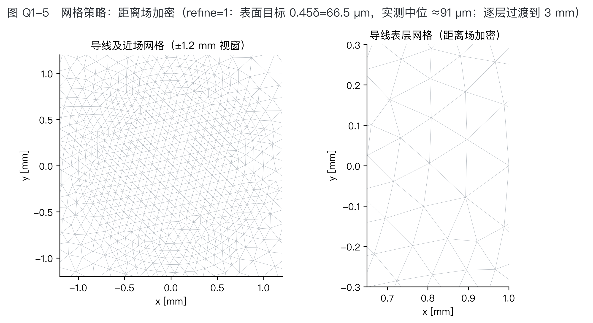
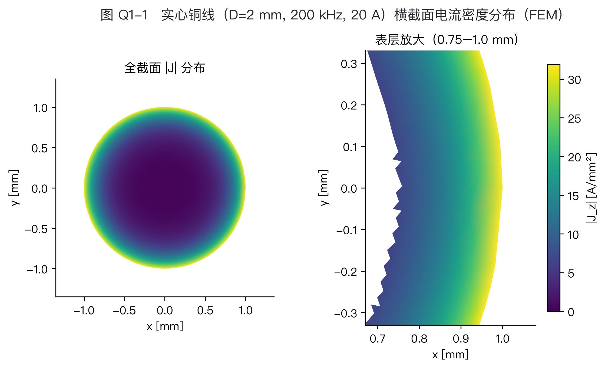
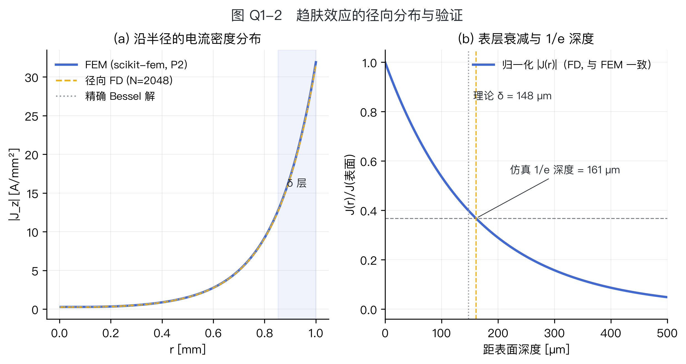
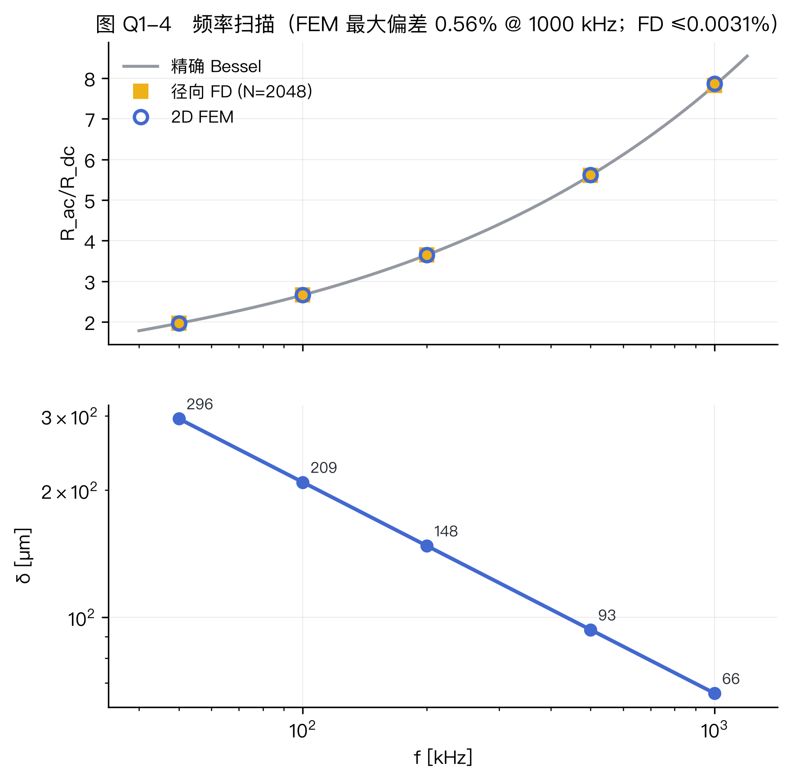
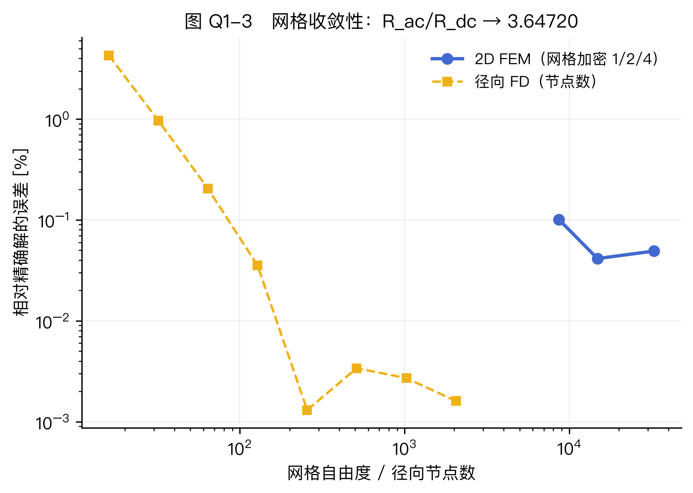

# 问题一　一根实心导线的高频仿真

## 1　问题重述与求解路线

问题一要求对直径 $D=2\ \mathrm{mm}$、长 $1\ \mathrm{m}$ 的实心圆铜导体建立涡流场仿真模型（激励 $20\ \mathrm{A_{rms}}$、$200\ \mathrm{kHz}$），完成趋肤深度计算、电流密度分布与交流电阻提取，并验证电流集中层厚度与网格收敛性。针对评分强调的「流程走通、数据真实可信」，本文采用**三条相互独立的路线**交叉验证，任务与路线对应如下（表 Q1-1）：

| **表 Q1-1** 原题任务 | 本文路线 | 章节与主要证据 |
|---|---|---|
| ① 由式 (1) 推导并计算 $\delta(200\,\mathrm{kHz})$ | 符号推导＋代入数值 | §2；`data/q1_results.json` |
| ② 建立 2 mm / 1 m 涡流场仿真模型 | 2D 有限元（scikit-fem，主路线）；径向有限差分、精确 Bessel 解（校核路线） | §3；`q1_solid/fem2d_skfem.py`、`q1_solid/radial_fd.py` |
| ③ 云图、$J(r)$ 曲线、$R_{ac}$ 与 $R_{ac}/R_{dc}$ | 图 Q1-1/Q1-2、表 Q1-2/Q1-3 | §4；`paper/figures/`、`data/*.csv` |
| ④ 层厚一致性、网格影响与收敛性 | 图 Q1-3/Q1-5、表 Q1-4/Q1-5 | §5；`data/q1_results.json` |

三条路线为：(i) **精确 Bessel 解** $Z_{\mathrm{int}}=k\rho J_0(ka)/(2\pi a J_1(ka))$，$k=(1+\mathrm{j})/\delta$；(ii) **径向有限差分**（三对角复对称方程组）；(iii) **2D 有限元**（$A$–$v$ 公式）。三者仅共享材料参数（`sim/constants.py`），数值上彼此独立。

## 2　任务一：趋肤深度推导与计算

良导体（$\omega\epsilon\ll\sigma$）中纵向电场满足扩散型 Helmholtz 方程，其解沿深度 $x$ 按 $E\propto\mathrm{e}^{-(1+\mathrm{j})x/\delta}$ 衰减，幅值降至表面 $1/e$ 的深度由式 (1) 给出：

$$\delta=\sqrt{\frac{2}{\omega\mu\sigma}}=\sqrt{\frac{\rho}{\pi f\mu}},\qquad \rho=\frac{1}{5.8\times10^{7}}=1.724\times10^{-8}\ \Omega\cdot\mathrm{m},\ \ \mu=\mu_0=4\pi\times10^{-7}\ \mathrm{H/m}.$$

代入 $f=200\ \mathrm{kHz}$：

$$\delta=\sqrt{\frac{1.724\times10^{-8}}{\pi\times2\times10^{5}\times4\pi\times10^{-7}}}=1.4777\times10^{-4}\ \mathrm{m}=147.77\ \mu\mathrm{m}$$

（`data/q1_results.json: delta_um = 147.7717`）。此时 $a/\delta=6.77$，导体直径约为 $\delta$ 的 13.5 倍，趋肤效应显著；同一公式给出扫频各频点 $\delta(f)$（表 Q1-3，`data/q1_sweep.csv`）。

## 3　任务二：仿真模型（求解器设置与网格策略）

本队使用非 ANSYS 的开源工具链，按赛题 2.2 要求说明如下。$1\ \mathrm{m}$ 导体几何与场沿轴向均匀，故取**单位长度二维横截面相量模型**（磁准静态，$\mathrm{e}^{\mathrm{j}\omega t}$，全部有效值）：所求 $R_{ac}$、$P$ 均为每米量，乘以 $1\ \mathrm{m}$ 即得整段导体数值（评估长度，`sim/constants.py: LENGTH`）。

**控制方程与弱式。** 以磁矢位 $A_z$ 与标量位 $v$ 表示 $E_z=-(\mathrm{j}\omega A_z+v)$，$J_z=\sigma E_z$。在铜盘＋空气域 $\Omega$ 上求 $(a,v)\in H^1_0\times\mathbb{R}$：

$$\frac{1}{\mu}\int_{\Omega}\nabla a\cdot\nabla w\,\mathrm{d}x-\mathrm{j}\omega\sigma\int_{\mathrm{Cu}}aw\,\mathrm{d}x-\sigma v\int_{\mathrm{Cu}}w\,\mathrm{d}x=0,$$

$$\mathrm{j}\omega\sigma\int_{\mathrm{Cu}}a\,\mathrm{d}x+\sigma A_{\mathrm{Cu}}\,v=-I .$$

第二式为**总电流约束的拉格朗日乘子行**（$I=20\ \mathrm{A_{rms}}$），替代端口激励；外边界 $A_z=0$，截断于 $r=30a=30\ \mathrm{mm}$。该装配为**复对称（不共轭）**形式，与 MQS 涡流场一致；求解器内置直流极限自检（$v=-I/(\sigma A_{\mathrm{Cu}})$ 时 $Z\to R_{dc}$ 精确成立）。

**求解器与网格策略。** 有限元：scikit-fem，三角 **P2 单元**（4 阶积分），scipy 稀疏直接解；$R_{ac}$ 用双口径提取（$P/I^2$ 与 $\mathrm{Re}[Z]=\mathrm{Re}[-v/I]$）互检。网格：gmsh 距离场加密（Frontal-Delaunay），表面**目标**单元尺寸 $0.45\delta=66.5\ \mu\mathrm{m}$（refine=1；实测中位 $\approx91\ \mu\mathrm{m}<\delta$，生产 refine=2 目标 $\approx33\ \mu\mathrm{m}$），经 $15\delta$ 过渡到 $3\ \mathrm{mm}$；meshio 桥接读入，铜/空气按单元质心几何分类（避免标签错位，见 `sim/gmsh_mesh.py`、`q1_solid/fem2d_skfem.py` 文档字符串）。单次求解亚秒级（refine=1/2/4 实测 0.2/0.3/0.8 s，见 `q1_solid/fem2d_skfem.py` 运行输出）。网格示意见图 Q1-5。校核路线：径向 FD 对 $(1/r)\,\mathrm{d}(r\,\mathrm{d}E_z/\mathrm{d}r)/\mathrm{d}r=\mathrm{j}\omega\mu\sigma E_z$ 作有限体积离散，边界 $\mathrm{d}E_z/\mathrm{d}r|_{a}=\mathrm{j}\omega\mu I/(2\pi a)$、轴心对称，$N=2048$。

**图 Q1-5**　网格策略（refine=1 基准网格）：距表面距离场加密，表面目标 $0.45\delta=66.5\ \mu\mathrm{m}$（实测中位 $60$–$110\ \mu\mathrm{m}$（口径依赖）），逐层过渡到 3 mm。

## 4　任务三：结果

**电流密度分布（图 Q1-1、Q1-2）。** 云图（顶点插值渲染）定性显示电流集中于表面薄层；定量取高分辨剖面：表面 $|J_z|=3.165\times10^{7}\ \mathrm{A/m^2}=31.7\ \mathrm{A/mm^2}$，轴线处 $2.80\times10^{5}\ \mathrm{A/m^2}=0.28\ \mathrm{A/mm^2}$，相差约 **113 倍**，与云图标尺一致；相位从轴线 $38.2^\circ$ 变到表面 $42.8^\circ$（`data/q1_J_r.csv` 首末行）。三法 $J(r)$ 曲线在图 Q1-2(a) 中重合——表面值 FD $3.1651\times10^7$ 与精确 Bessel $3.1602\times10^7$ 仅差 $-0.15\%$（`data/q1_jr_allmethods.csv` 末行）。等截面直流基准 $J_{dc}=6.37\ \mathrm{A/mm^2}$（$20\,\mathrm{A}/\pi\,\mathrm{mm^2}$）。注：题面任务②指定 $D=2$ mm，其 $J_{dc}$ 高于表 1 温升约束 $4\ \mathrm{A/mm^2}$——该约束自问题二起约束设计（最小铜截面 $5\ \mathrm{mm^2}$，等效实心 $D=2.523$ mm），本题按题面固定几何执行。

**图 Q1-1**　横截面 $|J_z|$ 云图及表层放大（FEM，$D=2$ mm，200 kHz，20 A）。数据：FEM 求解器现场输出。

**图 Q1-2**　(a) 径向 $J(r)$ 三法对比；(b) 表层归一化衰减与 1/e 深度。数据：`data/q1_J_r.csv`、`data/q1_jr_allmethods.csv`。

**交流电阻。** $R_{dc}=\rho/(\pi a^2)=5.488\ \mathrm{m\Omega/m}$，三法结果如下（200 kHz）：

**表 Q1-2**　$R_{ac}/R_{dc}$ 三法对比（`data/q1_results.json`、`findings.md`）

| 方法 | $R_{ac}/R_{dc}$ | 相对精确解偏差 |
|---|---|---|
| 精确 Bessel 解 | 3.64720 | — |
| 径向 FD（N=2048） | 3.64726 | +0.0016% |
| 2D FEM（refine=2，14 810 dof） | 3.6487 | +0.041% |

FEM 双口径 $R_{ac}=P/I^2=20.026\ \mathrm{m\Omega/m}$ 与 $\mathrm{Re}[-v/I]$ 一致到 0.01 m$\Omega$（`findings.md`）；损耗 $P=8.010\ \mathrm{W/m}$（`data/q1_results.json`，refine=4 网格——表 Q1-2 的代表值取 refine=2，头条数值以 refine=4 复核给出，评委可用 $20.026/5.488=3.6490$ 复算对应表 Q1-5 第 4 行）。频率扫描（图 Q1-4、表 Q1-3）：

**表 Q1-3**　频率扫描（`data/q1_sweep.csv`；FEM 列 `data/q1_results.json: sweep_fem`，refine=1 逐频点网格）

| $f$ [kHz] | $\delta$ [µm] | 精确解 | FD (N=2048) | FEM | $L_{int}$ [nH/m] |
|---|---|---|---|---|---|
| 50 | 295.5 | 1.96597 | 1.96603 | 1.97102 | 29.06 |
| 100 | 209.0 | 2.66163 | 2.66170 | 2.66563 | 20.73 |
| 200 | 147.8 | 3.64720 | 3.64726 | 3.65089 | 14.76 |
| 500 | 93.5 | 5.60864 | 5.60867 | 5.61965 | 9.38 |
| 1000 | 66.1 | 7.82213 | 7.82209 | 7.86604 | 6.65 |

内电感 $L_{\mathrm{int}}(f)$ 列取自 FD（`data/q1_sweep.csv`）：随频率升高、$\delta$ 收缩而减小，自直流极限 $\mu_0/8\pi=50$ nH/m 向高频小值过渡（200 kHz 为 14.76 nH/m），符合趋肤深度收缩的物理预期。本扫描对应统一工况表 1「鼓励 50 kHz–1 MHz 频率扫描」的附加验证项。

**图 Q1-4**　频率扫描 50 kHz–1 MHz：(a) $R_{ac}/R_{dc}$ 三法；(b) $\delta(f)$。

## 5　任务四：验证与讨论

**① 电流集中层厚度。** 由 FD 曲线（N=2048）提取 $|J|$ 降至表面值 $1/e$ 的深度为 **161.2 µm**（`data/q1_results.json: e_fold_depth_um`），与理论 $\delta=147.8\ \mu\mathrm{m}$ 同量级、偏大约 9%。偏差原因：$\delta$ 来自平面半无限导体解的纯指数衰减，而圆柱精确剖面 $J(r)=J(a)J_0(kr)/J_0(ka)$ 为复 Bessel 函数，其**幅值包络并非纯指数**且含径向相位分布（相位沿径向 38.2°→42.8°，`data/q1_J_r.csv` 首末行），故幅值 1/e 深度略大于 $\delta$，二者一致性成立。

**② 表层网格密度的影响与收敛性（图 Q1-3）。** FD 收敛表如下（`data/q1_results.json: fd_conv`，粗网格为系统性低估）：

**表 Q1-4**　径向 FD 网格收敛（200 kHz；误差为绝对值，$N\le128$ 档带符号为负——系统性低估）

| N | 16 | 32 | 64 | 128 | 256 | 512 | 1024 | 2048 |
|---|---|---|---|---|---|---|---|---|
| 误差 [%] | 4.29 | 0.96 | 0.20 | 0.035 | 0.0013 | 0.0034 | 0.0027 | 0.0016 |

相邻加密档误差比约 4–6，符合二阶格式 $O(h^2)$；$N\ge128$（径向步长 $h=a/127\approx7.9\,\mu$m $\approx\delta/19$）误差已低于 0.04%，$N\ge256$ 进入 10⁻³% 量级的数值噪声平台。FEM 收敛（`data/q1_results.json: fem_conv`；比值见 `findings.md`）：

**表 Q1-5**　FEM 网格收敛（200 kHz）

| 加密级别 | 自由度 | $R_{ac}/R_{dc}$ | 误差 [%] |
|---|---|---|---|
| refine=1 | 8 638 | 3.6509 | 0.101 |
| refine=2 | 14 810 | 3.6487 | 0.041 |
| refine=4 | 32 590 | 3.6490 | 0.049 |

FEM 误差由 0.10% 降至 0.04% 后进入平台，继续加密收益边际递减。结论：表层单元尺寸 $\le\delta$（本文目标 $0.45\delta$，实测 $\approx91\ \mu$m $<\delta$）即可将误差压至约 0.1%，推荐 refine=2 作为生产设置；更密的网格只带来约 0.05% 的平台内波动。

**图 Q1-3**　网格收敛性：FD 呈二阶斜率，FEM 误差 0.10%→0.04% 平台。

**③ 三法交叉验证。** 全部 5 个频点上 FD 与精确解偏差 $\le0.0031\%$，FEM 与精确解偏差 $\le0.57\%$（1 MHz 最大 0.561%，200 kHz 为 0.10%）；FEM 的 $P/I^2$ 与 $\mathrm{Re}[-v/I]$ 双口径一致到 0.01 mΩ，且通过直流极限自检。三条独立路线的闭环一致表明结果是真实可信的。

**④ 局限。** ①空气域截断于 30a——已复核：截断半径 30a→60a 时 $R_{ac}/R_{dc}$ 变化 $<1\times10^{-4}\%$（refine=2 复算，`data/q1_mesh_air30/60.msh`），影响可忽略；②P2 单元对表层陡峭剖面仍存在离散误差（表 Q1-5 平台的主要来源）；③轴向均匀假设忽略 1 m 导体端部效应（$1\ \mathrm{m}\gg2a=2$ mm，端部影响限于 $\delta$ 量级区域）；④FEM 的 P2 径向采样插值在早期版本曾退化为常数列（已修复）；当前 `data/q1_fem_J_r.csv` 为正常导出（即图 Q1-2(a) 的 FEM 曲线，表面 $3.190\times10^7$，较 FD +0.8%），1/e 深度仍取已验证的 FD 曲线以保守。

## 6　证据清单

| 结论 | 证据（图/数据/脚本） |
|---|---|
| $\delta=147.77\ \mu$m 及 $\delta(f)$ | `data/q1_results.json`（delta_um）、`data/q1_sweep.csv` |
| $J(r)$ 曲线、表面/轴线 $|J|$、相位 | `data/q1_J_r.csv`、`data/q1_jr_allmethods.csv` |
| 截面云图（任务③） | `paper/figures/q1_fig1_contour.png` |
| 1/e 深度 161.2 µm | `data/q1_results.json`（e_fold_depth_um）、图 Q1-2 |
| 三法 $R_{ac}/R_{dc}$、扫频（表 Q1-2/3） | `data/q1_results.json`（ratio_*、sweep_*）、`data/q1_sweep.csv`、`findings.md` |
| $R_{ac}=20.026$ mΩ/m、$P=8.010$ W/m、$R_{dc}=5.488$ mΩ/m | `data/q1_results.json`（rac_fem_mohm_per_m、p_loss_w_per_m、rdc_mohm_per_m） |
| 网格收敛（表 Q1-4/5） | `data/q1_results.json`（fd_conv、fem_conv）、图 Q1-3 |
| 网格策略与求解器设置 | 图 Q1-5、`sim/gmsh_mesh.py`、`q1_solid/fem2d_skfem.py` |
| 复现工程文件与顺序 | `./.venv/bin/python q1_solid/radial_fd.py` → `q1_solid/fem2d_skfem.py` → `q1_solid/truncation_check.py` → `q1_solid/make_figs.py`（依次产出 `data/` 与 `paper/figures/` 全部文件）；环境 Python 3.12.7 + numpy 2.5.3 / scipy 1.18.1 / scikit-fem 12.0.2 / gmsh 4.15.2 / meshio 5.3.5 / matplotlib 3.11.2 |

（注：1/e 深度提取不依赖 `data/q1_fem_J_r.csv`（取自 `data/q1_J_r.csv`）；前者即图 Q1-2(a) 的 FEM 曲线数据。）
