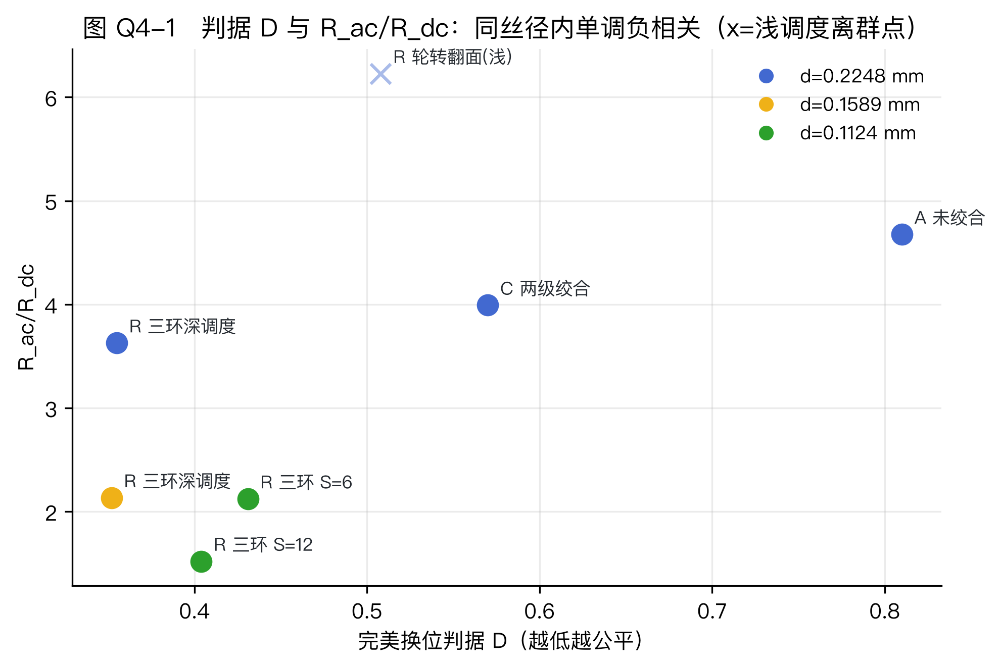

# 问题四　「完美编织」：判据、轮转翻面拓扑、判据↔性能与可制造性

## 1　判据的数学定义（三层，全部可计算）

**离散层（组合）**。$S$ 站采样得位置矩阵 $M\in[N]^{S\times N}$。完美 ⇔ ①每丝行是槽位的均匀重排（Latin 方性质；Berger 循环赛整体轮转为经典构造）；②对与泄漏场多极展开匹配的基 $\Phi=\{r,\ r\cos\theta,\ r\sin\theta,\ r^2,\ r^2\cos2\theta,\ r^2\sin2\theta\}$，$\sum_s \Phi(\mathrm{pos}_k(s))$ 对所有丝 $k$ 相等。

**拓扑层（辫群）**。交叉序列 = braid word $w=\sigma_{i_1}^{\pm1}\sigma_{i_2}^{\pm1}\cdots\in B_N$（关系 $\sigma_i\sigma_{i+1}\sigma_i=\sigma_{i+1}\sigma_i\sigma_{i+1}$）。周期缆完美 ⇔ $w^p\in P_N$（纯辫闭包，各丝归位）且 $\langle\pi(w)\rangle\le S_N$ 对槽位传递（每丝到达每槽）。校验器：`q4_perfect/braid_check.py`（`data/q4_topopt.json: topology` 各配置给出 `p_min_closure / group_transitive / unit_cycles / word_len_full`）。

**连续层（φ-矩标量）**。报告标量
$$D=\tfrac12 D_{dwell}+\tfrac12 D_\phi,\qquad D_\phi=\frac{1}{|\Phi|}\sum_{b\in\Phi}\ \max_{i,j}\Big|\textstyle\sum_s\phi_b(\mathrm{pos}_i(s))-\sum_s\phi_b(\mathrm{pos}_j(s))\Big|\Big/\max\phi_b,$$

（$D_\phi$ 含**基平均步**（勘误补记）：逐丝周期和对 6 个基 $\Phi$ 分别取跨丝极差、逐基归一化 $\max\phi_b$ 后**对基取等权算术平均**，`q4_perfect/criterion.py: DEFAULT_PHI_WEIGHTS`；§2 报告的逐基 $\Phi$ 矩即平均前的分量。）
$D_{dwell}$ 为各丝在 8 个径向壳层的停留分布与「面积加权均匀分布」的平均 TV 距离（`q4_perfect/criterion.py`；`data/q4_baselines.json: criterion`）。

**判据为什么刻画「电磁履历一致」**：束内损耗密度 $\varphi(r,\theta)$ 沿径向强烈分层（问题二实测：环电流从中心 0.011× 到最外环 3.37×），故「每丝时间平均的电磁环境相同」可操作化为「每丝对 $\varphi$ 的各阶矩相等」；$\Phi$ 基即 $\varphi$ 多极展开的低阶截断（$D_\phi$），壳层停留分布（$D_{dwell}$）是其径向零角近似。连续层可把 $\Phi$ 替换为 2D 切片提取的实际损耗密度——三层判据由粗到细、互相印证（`RESEARCH.md` §7.1）。

**规范敏感性定理与去旋转**。单绞向绞合是刚性旋转：丝间相对位置不变。天真地在实验室系计算 $D_\phi$ 会给刚性旋转体**虚假记功**——单绞向 25 mm 刚体的实验室系 $D_\phi^{lab}=0.138$（似近乎完美），去旋转（Kabsch 最优刚体对齐）后 $D_\phi=0.802$、$D=0.8104$，与未绞合基线**逐位相等**（差 $-2.2\times10^{-16}$；等价 RigidBundle 表象下严格相等，`q4_baselines.json: assertions`）。故本文一切 $D$ 均在去旋转系计算——这是判据层对问题二「刚性旋转定理」的镜像表述。

## 2　拓扑设计：轮转翻面族与三环实现

**轮转翻面族（rotoflip）**。$M{=}18$ 载纱器布于内外双环（每环 $m{=}9$，槽半径 $r_{in}{=}1.048$、$r_{out}{=}1.773$ mm，由微束堆积自洽导出：`data/q4_topopt.json: all_configs[].params`（`r_in_mm/r_out_mm`，112 配置同值；`layout` 注记其来源））。每站两环同时轮转 $c$ 个槽位；每 $m_{flip}$ 站执行一次**翻面**（内外环载纱器互换）。逐站截面状态由槽位置换表给出，交叉序列展开为 braid word（约定：扁平 $[i_1,e_1,\dots]$，$\sigma_i$ 交换相邻槽 $i{-}1,i$，左结合，全正交叉——$S_N$ 像与符号无关）。

**参数扫描 112 配置**（$c\in\{1..8\}\times m_{flip}\times$ 变体，`q4_topopt.json: all_configs`）。最优配置 $c{=}7,\ m_{flip}{=}2$（reverse）：$S{=}4$ 站、2 次翻面，$D_{strand}=0.5084$（$D_{dwell}=0.6443$、$D_\phi=0.3725$；逐基 $\Phi$ 矩：r 0.107 / $r\cos\theta$ 0.399 / $r\sin\theta$ 0.591 / $r^2$ 0.152 / $r^2\cos2\theta$ 0.473 / $r^2\sin2\theta$ 0.513），**群传递 true**、$p_{min}=2$、全字长 290；与次优 $c{=}2$ 配置站点坐标集合相同（简并）。**无翻面（$m_{flip}{=}0$）的任何配置群传递恒为 false**——「轮转管方位、翻面管径向」，纯轮转永不换层，正是刚性旋转定理的群论镜像。**可制造优选**：$c{=}4,\ m_{flip}{=}9$（reverse，$S{=}18$ 站、2 次翻面）$D_{strand}{=}0.5087$，仅比扫描最优高 $+0.05\%$（`q4_topopt.json: all_configs`）——翻面间隔放宽到每 9 站一次，切换装置动作最稀疏、碰撞风险最低，判据代价可忽略。

**三环实现（Q3 主力载体）**。$N=3\times k\times7$（$k{=}6/12/24$；载纱器 = 7 丝六角微束刚性随行，微束内不换位——诚实口径，对应 Roebel multi-stack 的部分换位死区）。节拍（`q3_braid/multiring.py`）：每站全部环轮转 $c{=}5$ 槽，每 2 站执行**环循环**（载纱器 $1\to2\to3\to1$ 环、环内槽号保持），$S{=}6$ 站一周期；深调度把环循环间隔加倍至每 4 站（$S{=}12$，主力口径）。$D$: R126 0.355 / R252 0.352 / R504 0.431（`q3_final_summary.json: D_values`；其中 R504 0.431 为 $S{=}6$ 口径，$S{=}12$ 深调度复算 0.404——`multiring.py`+`criterion.py`，三个已发布值逐位复现）。

## 3　判据 ↔ 性能（同丝径单调负相关 + 浅调度离群）

**图 Q4-1**　$D$ ↔ $R_{ac}/R_{dc}$ 六点（文件名 `q3_fig1_d_rac.png`，跨题引用；图内标题沿用早期编号「Q3-1」）。数据：`data/q4_d_rac_points.json`。

**表 Q4-1**　判据-性能六点（等铜截面 5 mm²、200 kHz）

| 方案 | $D$ | $d$ [mm] | $R_{ac}/R_{dc}$ |
|---|---|---|---|
| A 未绞合 | 0.810 | 0.2248 | 4.676 |
| C 两级绞合 | 0.570 | 0.2248 | 3.992 |
| R 轮转翻面（浅调度） | 0.508 | 0.2248 | **6.228（离群）** |
| R 三环深调度 | 0.355 | 0.2248 | 3.628 |
| R 三环深调度 | 0.352 | 0.1589 | 2.134 |
| R 三环 | 0.431 | 0.1124 | 2.123 |

同 $d{=}0.2248$ 共四点，除轮转翻面离群点外其余三点严格单调负相关（$D$ 0.810→0.570→0.355 对应 4.68→3.99→3.63）：**判据在该族内是一致的性能预报器**（离群点机理明确、不破坏单调带，见下）。离群点机理 = **调度深度**：浅调度（$S$ 不足）下换位网络不足以压平串联电流失衡，均流的横向邻近代价先到——$D$ 是必要非充分条件，与 $Q_3$ §5 的 $S{=}6$ vs $12$ 深度比 2.02× 互证。另注意 $D$ 与串联 $\eta_I$ 是不同对象：R504 的 $D$（0.431）高于 R252（0.352）而比值更低（2.123 vs 2.134；深调度补全后 1.521 vs 2.134，反差更大）——连续层 φ-矩相等只是均流的近似必要条件。

## 4　与问题三最优方案的对比

R504 三环深调度 $S{=}12$（补全点，`data/q3_depth_completion.json`）为 Q3 全梯度最优：$R_{ac}/R_{dc}=1.5213$、$\eta_I=12.4\%$——**撞线布局修正地板**。名义地板 $R_{ideal}=\bar m F(\gamma_s)+3.369(d/0.2248)^2=1.92$（$d{=}0.1124$）出自 $\alpha_L{=}1.714$ 布局；R504 三环束更粗（$\alpha_L\approx2.25$ mm），邻近场 $H\propto1/\alpha_L$、地板邻近项 $\propto1/\alpha_L^2$ → 布局修正地板 **≈1.55**（公式系数链出处 `q4_perfect/run_q4.py` + `paper/PAPERS_NOTES.md`（Umetani 阶梯），权威值入 `q3_final_summary.json: floor_formula`）。1.5213 距修正地板 −1.9%，在 FEM 锚定与地板解析式的联合不确定度内视为撞线——**Q4「完美编织」在所探三环深调度族内基本达成**。「换位 × 细丝 × 深度」三元乘积在此汇合：单靠拓扑（R126，−6.5%）或单靠细丝（A504 刚性 3.73）都到不了 1.5；深调度在 $d^{4}$ 放大区把欧姆项从 2.35 压到 1.91 W/m、横向邻近从 0.72 压到 0.58 W/m，$h_\parallel$ 绝对量仅 0.10 W/m（约占总损 4%；三段 = 1.91/0.58/0.10 W/m，`q3_depth_completion.json`），逼近「每丝电磁履历一致」的解析下界。同等约束（等铜截面、等频率、等激励）下与 Q3 其余方案的差距一并报告：较两级绞合 C（3.9916）改善 −61.9%，较 R252 深调度（2.1344）−28.7%，较同拓扑浅调度 $S{=}6$（2.1232）−28.3%。**收敛表述（修正）**：Q3 性能最优与 Q4 判据最优不宣称「同一方案」——argmin $D$ 在 R252（0.352），R504 反而更高（$S{=}6$ 口径 0.431 / 深调度复算 0.404），$D$ 必要非充分的又一体现（与 §3 离群同源）；两者在**同一拓扑族**（三环 × 深调度）内收敛，闭环自洽。

## 5　可制造性讨论

**事件序列层**。本拓扑的「拓扑 → 事件 → 轨迹」分层与文献一一对应：Liu et al.（IJAMT 2025, 138(11-12):5877–5890，bib key `Liu2025application`）把编织机床形式化为图（节点=槽位/轨道交点）、载纱器路径=连通图遍历、床面分典型区/切换区——事件图的直接学术对应；Assi et al.（IJAMT 2023，bib key `Assi2023graph`）的图论碰撞检测 = 事件图并行边合法性判据。

**机器对应**。轮转步（$c$ 槽/站）= 角齿轮 60° 步进索引（每角齿轮独立驱动的 ITA 机型已实现，Emonts et al., Textiles 2021，bib key `Emonts2021innovation`，原文 p.187「载纱器在各自角齿轮上几乎独立运动」）；翻面/环循环 = 切换装置跨环搬移载纱器（六角机用 lace 型切换装置、旋转机用气动轨道切换——注意「无机械开关」属 Li 2023/CN117506379A 一类机型，勿归于 Emonts）；笛卡尔 4 步法（Emonts pp.199–200）给出在六角硬件上复现环形编织的已发表事件词汇。纱长补偿 $\Delta L=L_{1,2,max}-L_{min}$（Emonts 式 (1)）对应我方逐轨道长度因子 $\bar m$ 的最大−最小散布控制。

**容量与风险**。Emonts Table 1：现役六角机 60 载纱器/7 角齿轮/1400 cm²/<1 s/步（TRL 7），旋转机 48 锭——本设计 R126 三环（18 载纱器）与轮转翻面（M=18）均在容量内；R252（36）在内；R504（72）超出现役、需 gen1 级 132 锭床（5 s/步）或两级成缆实现。Goldacker et al.（SuST 2014，bib key `Goldacker2014roebel`）佐证概念层：Roebel 是「唯一提供完全换位的缆概念」，其 multi-stack 官方部分换位反例正对应我方微束内死区；英国 MTC 已在 switch-track 编织机上试编 Litz 线（工程可行性实证）。风险如实声明：ITA 机型未见漆包细线加工数据，0.2248/0.1124 mm 漆包丝的摩擦磨损未经验证；复杂花样须预先碰撞仿真（Emonts p.202 结论）。

## 6　成果展示网站与证据清单

**网站**（`web/`，Vite + 原生 three.js，无 UI 框架）：三页骨架（原理 / 编织查看器 / 数据，hash 路由）；查看器 `src/braid.js` 用 `TubeGeometry`+自定义 `Curve` 渲染逐丝轨迹、z 向剖切动画与同步 2D 截面；数据页展示轨迹 JSON 内预计算的判据指标。**真实拓扑 demo 已接入并置为主力**（`src/main.js` 的 `DEMOS` 列表首位）：demo3-threering = 三环深调度真实轨迹（`q3_braid/multiring.py` 流水线，$N{=}126$、每 4 站环循环，随 JSON 交付论文同口径判据 $D{=}0.313$：$D_{dwell}{=}0.354$ / $D_\phi{=}0.271$）；demo4-untwisted = 同几何冻结对照（$D{=}0.814$）——网站复算值与论文判据值（0.355 / 0.810，`q3_final_summary.json: D_values`）同序同量级，差异来自轨迹连续化与采样（481 采样 / 48 mm 单周期）。另保留两个示意 demo（`web/tools/gen_demo.py` 生成，2 基 $\{r, r^2\}$ 离散层口径）：demo1 单绞向（$D{=}1.0$ 刚体旋转对照）、demo2 轮转翻面（$D\approx0.006$ 示意几何）；后续拓扑按同格式新增 JSON 并在 `DEMOS` 登记即可，查看器与数据页零改动。**部署管线**：`.github/workflows/deploy.yml`（npm ci → build → GitHub Pages），`vite.config.js` 的 `base='/litz-braided-wire/'`，构建绿（commit f9e8ca4）；**待部署事项**：仓库改名并启用 Pages（Settings → Pages → GitHub Actions）、`public/figures/` 快照刷新（Q1/Q2 图已拷，Q3 三图待拷入）、截止前以公开 URL 验收并同交源码。

**证据清单**：判据与基线 `data/q4_baselines.json`（未绞/单绞向 0.8104 逐位相等、两级 0.5703、实验室系虚假记功 0.138）；拓扑扫描 `data/q4_topopt.json`（112 配置、top3 全套 braid word/槽位表/站点坐标）；判据↔性能 `data/q4_d_rac_points.json` + 图 `figures/q3_fig1_d_rac.png`；性能与地板 `data/q3_final_summary.json`；脚本 `q4_perfect/{criterion,braid_check,rotoflip,run_q4}.py`；网站 `web/`（README 含本地开发与部署全流程）。
