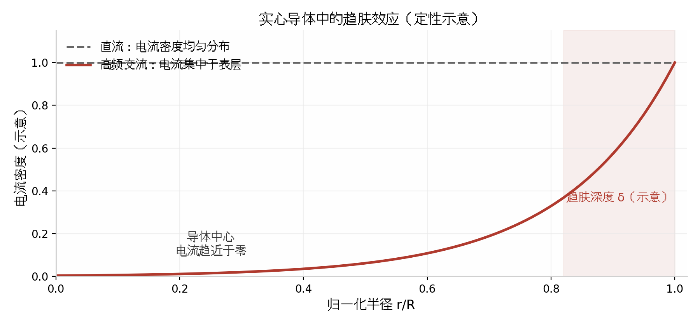
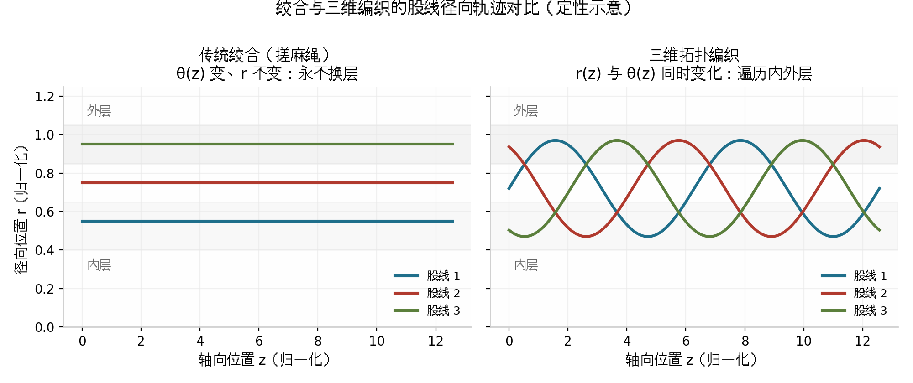
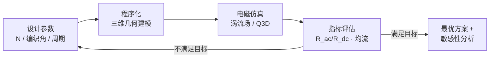

# 三维拓扑编织 Litz 线的电磁优化设计

**—— 从趋肤效应仿真到「完美编织」的开放探索 ——**

> **数学建模竞赛赛题**
>
> 竞赛时长：连续 48 小时
> 允许并鼓励使用：AI 大模型 · 三维建模工具 · 电磁仿真软件
>
> **本赛题没有标准答案，一切结论以真实仿真数据为准。**
>
> 命题背景支持：CTMA / K-TLitz 三维拓扑编织研究项目

---

## 目录

- [一、赛题背景](#一赛题背景)
  - [1.1 趋肤效应：电流为什么「只走表皮」](#11-趋肤效应电流为什么只走表皮)
  - [1.2 Litz 线：把粗导体「化整为零」](#12-litz-线把粗导体化整为零)
  - [1.3 邻近效应：细丝之间的新矛盾](#13-邻近效应细丝之间的新矛盾)
  - [1.4 从绞合到三维拓扑编织](#14-从绞合到三维拓扑编织)
  - [1.5 技术进展与本赛题的调优方向](#15-技术进展与本赛题的调优方向)
- [二、竞赛形式与规则](#二竞赛形式与规则)
- [三、统一工况与给定条件](#三统一工况与给定条件)
- [四、问题描述](#四问题描述)
  - [问题一　一根实心导线的高频仿真（走通流程，15 分）](#问题一一根实心导线的高频仿真走通流程15-分)
  - [问题二　设计你的第一根 Litz 线（20 分）](#问题二设计你的第一根-litz-线20-分)
  - [问题三　编织方案的仿真调优（30 分）](#问题三编织方案的仿真调优30-分)
  - [问题四　追寻「完美编织」与成果展示网站（35 分）](#问题四追寻完美编织与成果展示网站35-分)
- [五、评价指标与评分标准](#五评价指标与评分标准)
- [六、提交要求与清单](#六提交要求与清单)
- [附录 A　材料参数与常用公式](#附录-a材料参数与常用公式)
- [附录 B　术语表](#附录-b术语表)
- [附录 C　推荐工具链](#附录-c推荐工具链)

---

## 一、赛题背景

### 1.1 趋肤效应：电流为什么「只走表皮」

当导体中通过交流电流时，电流周围产生交变的环形磁场；交变磁场又在导体内部感应出涡流，涡流的方向恰好把电流「挤」出导体中心。频率越高，这种排斥越强烈，最终电流几乎全部集中在导体表面的一层薄皮内——这就是**趋肤效应（Skin Effect）**。

描述这一层「皮」厚度的物理量是趋肤深度 $\delta$，即电流密度衰减到表面值 $1/e$ 处距表面的深度：

$$\delta = \sqrt{\frac{2}{\omega \mu \sigma}} = \sqrt{\frac{\rho}{\pi f \mu}} \tag{1}$$

其中 $\omega = 2\pi f$ 为角频率，$\mu$ 为磁导率，$\sigma = 1/\rho$ 为电导率。对铜导体而言，频率进入数百 kHz 量级后，趋肤深度仅有**百微米量级**——一根毫米级的粗铜线，其中心区域的铜材在高频下几乎不承担电流，成为「摆设」。导体的交流电阻 $R_{ac}$ 因此远大于直流电阻 $R_{dc}$，高频损耗急剧上升。

**图 1**　实心导体中电流密度的径向分布（定性示意）。直流下电流均匀分布；高频交流下电流被「挤」到厚度约 $\delta$ 的表层。

### 1.2 Litz 线：把粗导体「化整为零」

对抗趋肤效应的经典思路是 **Litz 线**（利兹线，源自德语 Litzendraht）：不用一根粗导体，而是用 $N$ 根**相互绝缘**的细铜丝并联传导电流。只要单根细丝的直径 $d$ 小于趋肤深度 $\delta$，每根细丝内部的趋肤效应就基本消失，整束导体的有效导电截面被重新「唤醒」。丝间绝缘（通常为微米级漆膜）是必不可少的——否则细丝之间导通，整束线又退化为一根粗导体。

工程上通常引入无量纲丝径系数 $\beta = d/\delta$ 来描述细径化程度：$\beta < 1$ 保证单丝内部趋肤效应可忽略，但 $\beta$ 也不是越小越好——丝越细，绝缘占比与加工成本越高，收益递减。如何选择 $\beta$、$N$ 与总铜截面的搭配，本身就是设计问题。

### 1.3 邻近效应：细丝之间的新矛盾

细径化解决了「一根丝内部」的问题，却带来了「丝与丝之间」的新问题：**邻近效应（Proximity Effect）**。束中每根细丝都处于其余细丝电流产生的磁场中；处于束外层的细丝长期暴露在更强的交变磁场下，感应出更大的涡流损耗、承担更大的电流；内层细丝则相对「清闲」。股与股的电磁处境不公平，结果是外层细丝发热严重、整束导体的交流电阻仍远高于理想值——$R_{ac}/R_{dc}$ 难以逼近 1。

### 1.4 从绞合到三维拓扑编织

解决邻近效应的关键是**换位（Transposition）**：让每根细丝沿线轴周期性地变换自己在束截面中的位置，使所有丝在平均意义下拥有相同的「电磁履历」——走过同样长的外层、同样长的内层，电流自然均分，损耗均摊，无局部热点。

传统的换位方式是**绞合**：像搓麻绳一样把丝束拧起来。但仔细分析绞合的几何：每根丝的轨迹是半径 $r$ 固定、方位角 $\theta(z)$ 变化的二维螺旋——外层丝永远在外层，只是换了一个角度，**从未真正进入过内层**。绞合的换位是不彻底的。

更彻底的方案是**三维拓扑编织**：借鉴纺织工业中管状编织机的思想，让每根丝走真正的三维轨迹 $(r(z),\theta(z),z)$，在一个结构周期内从外层进入中层、再进入内层、再回到外层，完整遍历所有径向位置。图 2 给出了两种结构下股线径向轨迹的定性对比。

**图 2**　绞合与三维编织的股线径向轨迹对比（定性示意）。左：绞合中每根丝的半径不变，永不换层；右：三维编织中每根丝周期性遍历内外层。

### 1.5 技术进展与本赛题的调优方向

近年来，随着三维编织装备、程序化几何建模与高性能电磁仿真的发展，「为电磁性能而设计拓扑」正在从经验工艺变成一门可计算的学问。研究者开始用**拓扑编码**（如以交叉序列 $\beta = \sigma_1 \sigma_3 \sigma_5 \sigma_2 \cdots$ 描述的 braid word）精确刻画编织结构，并将「目标结构」编译为「制造事件序列」（事件图，Event Graph），再进一步映射为载纱器轨迹与送线、张力控制指令——即「拓扑 → 事件 → 轨迹」的分层编译思想。这意味着：一种编织方案不仅可以被仿真评估，还可以被严格地描述、比较、搜索，乃至被机器制造。

在这一框架下，本赛题的调优与测试方向可以概括为四个层层递进的问题：

1. **仿真可信度**：能否建立正确的电磁仿真流程，用真实数据复现趋肤效应这一基础物理规律；
2. **结构设计**：能否基于物理理解，自主设计一款参数合理的 Litz 线并验证其性能；
3. **编织调优**：能否以仿真为实验手段，系统地搜索编织参数空间，提升换位的彻底程度、降低交流损耗；
4. **前沿探索**：能否提出「理想换位」的数学判据，并设计出逼近该判据、同时具备可制造性的编织拓扑。

与传统赛题不同，本赛题的区分度不在论文写作速度——在强 AI 模型的加持下，论文本身两三个小时即可完成——而在于**谁能真正跑通仿真、跑出可信的数据、并用数据驱动结构的迭代优化**。这也是本赛题设置第四题「成果展示网站」的原因：你的方案好不好，应当能被任何人打开网页、亲手检验。

---

## 二、竞赛形式与规则

### 2.1 竞赛形式

- 竞赛时间为**连续 48 小时**，以队为单位参赛，开卷进行。
- 本赛题共设四道问题。问题一、二为引导题，帮助各队走通「建模—仿真—验证」的完整流程；问题三、四为开放性优化与探索题，**没有标准答案**，以仿真数据与工程论证的充分程度评定优劣。

### 2.2 允许使用的工具

- **AI 大模型**：允许并鼓励使用各类 AI 助手进行文献调研、代码编写、几何建模脚本生成、优化搜索与论文撰写；
- **三维建模工具**：不限工具，可使用 SolidWorks、Fusion 360、Blender，或程序化建模（Python + CadQuery / OpenSCAD / trimesh 等）生成编织几何；
- **电磁仿真软件**：推荐 ANSYS Maxwell（涡流场求解器）或 ANSYS Q3D Extractor（频变电阻/电感提取）；也可使用 COMSOL Multiphysics、开源 FEMM 等同类工具。使用非 ANSYS 软件须在论文中说明求解器设置与网格策略。

### 2.3 AI 使用声明

各队须在论文附录中提交 **AI 工具使用声明**，如实列出使用了哪些 AI 模型与工具、分别用于哪些环节（如：几何脚本生成、参数搜索、论文润色）。AI 使用本身不影响成绩；但未如实声明的，一经发现按学术不端处理。

### 2.4 数据真实性要求

本赛题的核心评分依据是**真实仿真数据**。所有关键结论（电阻、电流分布、损耗对比等）必须可由提交的仿真工程文件或原始导出数据复现。仅凭 AI 生成、未经仿真验证的「结论」不计分；编造或伪造仿真数据按学术不端处理。

---

## 三、统一工况与给定条件

为保证各队结果可比，四道问题统一采用下列工况。除明确允许自主选择的参数外，其余条件不得更改。

**表 1　统一工况与材料参数**

| 参数 | 取值 | 说明 |
| --- | --- | --- |
| 导体材料 | 无氧铜 | 电导率 $\sigma = 5.8\times10^{7}\ \mathrm{S/m}$，相对磁导率 $\mu_r = 1$ |
| 工作频率 $f$ | $200\ \mathrm{kHz}$ | 鼓励在 50 kHz – 1 MHz 内做频率扫描分析 |
| 目标载流 $I$ | $20\ \mathrm{A}$（有效值，正弦） | 四道问题共用 |
| 温升约束 | $J_{dc} \le 4\ \mathrm{A/mm^2}$ | 直流意义下的电流密度上限，据此确定最小铜截面 |
| 评估长度 | $1\ \mathrm{m}$ | 损耗与电阻均按每米评估 |
| 细丝绝缘 | 聚氨酯漆膜 | 电磁建模中可忽略漆膜厚度，但必须保证丝间电绝缘 |
| 环境温度 | $20\ ^\circ\mathrm{C}$ | 不考虑温度对电导率的反馈（热电解耦） |

> 注：问题三、四在保证「总铜截面一致、频率一致」的前提下，股数、丝径、编织结构等设计参数由各队自主确定。

---

## 四、问题描述

### 问题一　一根实心导线的高频仿真（走通流程，15 分）

**背景引导：** 一切设计的起点，是先用仿真「看见」趋肤效应。本题要求各队建立从几何建模到结果提取的完整仿真流程，并用理论公式交叉验证。

**任务：**

1. 由式 (1) 推导并计算 $200\ \mathrm{kHz}$ 下铜的趋肤深度 $\delta$；
2. 建立直径 $D = 2\ \mathrm{mm}$、长度 $1\ \mathrm{m}$ 实心圆铜导体的电磁仿真模型（ANSYS Maxwell 涡流场或 Q3D；二维轴对称或三维模型均可），施加 $20\ \mathrm{A}$、$200\ \mathrm{kHz}$ 交流激励；
3. 输出并提交：导体截面上的电流密度分布云图、沿径向的 $J(r)$ 曲线、导体的交流电阻 $R_{ac}$ 与 $R_{ac}/R_{dc}$；
4. 验证与讨论：仿真得到的电流集中层厚度与理论趋肤深度是否一致？表层网格剖分密度对结果有何影响？给出你的网格收敛性说明。

**要求：** 本题重点不在结果是否「漂亮」，而在流程是否走通、数据是否真实可信。所有结论必须附仿真截图或导出数据。

---

### 问题二　设计你的第一根 Litz 线（20 分）

**背景引导：** 问题一应当已经表明：高频下电流不走导体的中间，中心的铜被浪费了。Litz 线的对策是「化整为零」——用 $N$ 根相互绝缘的细丝替代实心导体。但丝该多细？该用多少根？由你来定。

**任务：**

1. **确定设计约束：** 在统一工况下，给出丝径 $d$ 的选择依据（与趋肤深度 $\delta$ 的定量关系），并据此确定股数 $N$ 与总铜截面（须满足载流与温升约束）；
2. **结构设计：** 自主设计细丝的空间排布与绞合/成束方式（本题采用规则绞合或简单成束即可），用三维建模工具或程序化脚本建立几何模型；
3. **电磁仿真：** 对你设计的 Litz 线施加同样的 $20\ \mathrm{A}$、$200\ \mathrm{kHz}$ 激励，提取电流分布与 $R_{ac}/R_{dc}$，与问题一的等截面实心导体对比；
4. **讨论：** 各根细丝的电流是否均匀？外层丝与内层丝的电流密度有何差别？造成差别的原因是什么？这一观察将直接引出问题三。

**要求：** 设计依据必须清晰可追溯——为什么是这根丝径、这个股数、这种排布。Litz 线束的几何建模是后续各题的基础，建议采用参数化脚本建模以便迭代。

---

### 问题三　编织方案的仿真调优（30 分）

**背景引导：** 问题二的讨论应当已经揭示：细丝成束后出现了新的不公平——邻近效应。换位的彻底程度决定 $R_{ac}/R_{dc}$ 能压到多低。传统绞合中每根丝只绕轴转圈、永不换层；三维编织让每根丝在内外层之间周期性遍历。从本题起，没有标准答案——你的仿真数据就是裁判。

**任务：**

1. **定义评价目标：** 在等总铜截面、等频率约束下，以 $R_{ac}/R_{dc}$ 最小化为核心目标；可自行补充辅助指标（如各股电流的均流偏差、热点温升等），并说明指标定义；
2. **参数化你的编织方案：** 明确你的设计变量，例如股数 $N$、编织角、换位周期、单层/多层结构、子束分层方式等；
3. **建立调优闭环：** 形成「参数 → 三维几何 → 电磁仿真 → 指标评估 → 修改参数」的迭代流程（见图 3），用仿真数据系统比较**至少 3 种**本质不同的换位/编织方案；
4. **给出最优方案与敏感性分析：** 报告你找到的最优方案及其参数，并分析关键参数（如编织角、换位周期）对指标的影响规律；
5. **保留调优记录：** 提交迭代过程的数据表或日志，展示方案是如何一步步变好的。

**图 3**　问题三建议的仿真驱动调优闭环。

**要求：** 方案间比较必须控制变量（同截面、同频率、同激励）。鼓励使用 AI 辅助几何脚本生成与参数搜索，但每个进入论文的结论都必须有对应仿真数据支撑。

---

### 问题四　追寻「完美编织」与成果展示网站（35 分）

**背景引导：** 换位可以做到多彻底？是否存在一种「完美编织」，让每根丝的电磁履历严格一致？这是当前研究的开放前沿。本题为全开放探索题，评价的是思想的深度、证据的强度与呈现的质量。

**任务：**

1. **提出判据：** 给出你对「完美换位」的数学定义——什么样的空间轨迹分布才算彻底公平？（提示：可从每根丝在各径向壳层上的停留分布、方位角覆盖等角度形式化表述。）说明你提出的判据为什么能刻画「电磁履历一致」；
2. **设计拓扑：** 设计一种（或一族）逼近该判据的三维编织拓扑，并用严格的数学语言描述其结构（例如交叉序列 / braid word、逐站截面状态、股线轨迹方程等，形式不限）；
3. **仿真验证：** 对你的拓扑进行电磁仿真，与问题三的最优方案在同等约束下对比，报告差距；
4. **可制造性讨论：** 你的编织能否被制造？请定性讨论实现它所需的运动/事件序列（例如：哪些股线必须先交叉、哪些动作可以并行、层间如何交换），可借鉴「拓扑 → 事件 → 轨迹」的分层思想，但不要求给出机器代码；
5. **构建成果展示网站：** 搭建一个公开可访问的网站，系统展示你的全部解答——物理原理的可视化讲解、四道题的建模过程与仿真数据、三维结构的可交互展示（如可旋转的编织模型、逐站截面动画等）。网站的信息架构、可视化质量与交互体验纳入评分。

**要求：** 本题鼓励大胆创新，但「大胆」必须与「严谨」并存：判据要可计算，结构要可描述，结论要有仿真证据，制造讨论要符合几何与力学常识。网站须在比赛截止时可通过公开 URL 访问，并同时提交源码。

---

## 五、评价指标与评分标准

### 5.1 核心评价指标（建议定义）

以下指标供各队在论文中统一定义与使用；各队也可在此基础上提出更合理的变体，但须说明理由。

**表 2　建议评价指标**

| 指标 | 定义 | 物理含义 |
| --- | --- | --- |
| 交直流电阻比 | $R_{ac}/R_{dc}$ | 高频损耗相对理想值的倍数，越接近 1 越好；本赛题的核心指标 |
| 均流偏差 | $\eta_I = \max_i \|I_i - \bar{I}\| \,/\, \bar{I}$ | 各股电流偏离均值的最大相对偏差，刻画换位公平性 |
| 每米损耗 | $P = I^2 R_{ac}$（每米） | 工程直接关心的发热量 |
| 换位充分性 | 各股在径向壳层上的停留分布与「按壳层面积加权均匀分布」的偏差（自定义形式化） | 问题四「完美编织」判据的参考方向 |

### 5.2 评分权重

**表 3　评分标准（满分 100 分）**

| 题目 | 评分要点 | 分值 | 小计 |
| --- | --- | --- | --- |
| 问题一 | 仿真流程完整走通（建模、激励、求解、后处理） | 5 | **15** |
| | 数据真实可复现（工程文件 / 导出数据 / 截图） | 5 | |
| | 与趋肤深度理论的交叉验证与网格收敛性讨论 | 5 | |
| 问题二 | 丝径、股数、截面的设计依据清晰定量 | 8 | **20** |
| | Litz 线几何建模质量与仿真对比完整 | 8 | |
| | 对股间电流不均现象的观察与机理讨论 | 4 | |
| 问题三 | 指标体系定义合理、变量受控 | 6 | **30** |
| | 参数化建模与「设计—仿真—评估」迭代流程 | 8 | |
| | 至少 3 种方案的同约束对比与最优方案论证 | 10 | |
| | 参数敏感性分析与调优记录完整性 | 6 | |
| 问题四 | 「完美换位」判据的数学定义与合理性论证 | 8 | **35** |
| | 编织拓扑的数学描述与创新性 | 8 | |
| | 仿真证据与可制造性讨论 | 7 | |
| | 成果展示网站（信息架构、三维可视化、交互体验、可访问性） | 12 | |

> 说明：问题一、二为引导题，流程走通、数据真实即可获得大部分分数；竞赛区分度主要体现在问题三、四。四道题共用一篇论文，不要求篇幅，要求逻辑连贯、证据链完整。

---

## 六、提交要求与清单

比赛截止时，各队须一次性提交以下全部材料：

**表 4　提交清单**

| 序号 | 材料 | 要求 |
| --- | --- | --- |
| 1 | 赛题论文（PDF） | 含问题重述、模型假设、建模过程、仿真设置、结果分析与结论；正文须标明每道问题的对应章节 |
| 2 | 仿真证据包 | 各题关键仿真结果：电流密度云图、$J(r)$ 曲线、$R_{ac}$ 提取结果等；附工程文件或完整的求解器设置说明与原始导出数据（CSV/截图），保证可复现 |
| 3 | 几何模型源文件 | 三维模型源文件或程序化建模脚本（推荐脚本，便于参数复现） |
| 4 | 展示网站 | 公开可访问的 URL，并提交网站源码打包文件；截止时网站须能正常打开 |
| 5 | AI 工具使用声明 | 列出所用 AI 模型/工具及其用途环节（见 2.3 节） |

---

## 附录 A　材料参数与常用公式

**表 A1　铜的电磁参数（20 ℃）**

| 参数 | 符号 | 取值 |
| --- | --- | --- |
| 电导率 | $\sigma$ | $5.8\times 10^{7}\ \mathrm{S/m}$ |
| 电阻率 | $\rho$ | $1.72\times 10^{-8}\ \Omega\cdot\mathrm{m}$ |
| 相对磁导率 | $\mu_r$ | $1$ |
| 真空磁导率 | $\mu_0$ | $4\pi\times 10^{-7}\ \mathrm{H/m}$ |

常用公式：

$$\delta = \sqrt{\frac{\rho}{\pi f \mu_0 \mu_r}} \tag{A1}$$

$$R_{dc} = \frac{l}{\sigma A}, \qquad P = I^2 R_{ac} \tag{A2}$$

$$\beta = \frac{d}{\delta}, \qquad N = \frac{4A}{\pi d^2} \tag{A3}$$

> 式 (A3) 给出了丝径系数、股数与总铜截面之间的基本关系，是问题二设计计算的基础。

---

## 附录 B　术语表

**表 B1　术语表**

| 术语 | 释义 |
| --- | --- |
| 趋肤效应（Skin Effect） | 高频交流下电流向导体表面集中的现象，特征厚度为趋肤深度 $\delta$ |
| 邻近效应（Proximity Effect） | 相邻导体电流产生的磁场互相感应涡流，导致各股电流分布不均的现象 |
| Litz 线（利兹线） | 由大量相互绝缘的细丝按特定方式绞合/编织而成的高频导线 |
| 换位（Transposition） | 让各股细丝沿线轴周期性变换径向/周向位置，使各股电磁履历趋于一致的结构措施 |
| 三维拓扑编织 | 股线轨迹 $(r(z),\theta(z),z)$ 在三维空间中周期性遍历内外层的编织结构 |
| 编织角 | 股线螺旋方向与缆轴线的夹角，决定径向行程与结构周期 |
| 交叉序列 / Braid Word | 用交叉算子序列（如 $\beta=\sigma_1\sigma_3\sigma_2\cdots$）对编织拓扑的符号化描述 |
| 事件图（Event Graph） | 把目标拓扑分解为带依赖关系的制造事件（交叉、换位、保持等）的有向图，是「结构」通往「制造」的中间层 |
| $R_{ac}/R_{dc}$ | 交流电阻与直流电阻之比，趋肤与邻近效应损耗的综合度量 |

---

## 附录 C　推荐工具链

**表 C1　推荐工具链（不限于此）**

| 环节 | 推荐工具 | 备注 |
| --- | --- | --- |
| 电磁仿真 | ANSYS Maxwell / Q3D Extractor；备选 COMSOL、FEMM | 使用备选工具须说明求解器设置与网格策略 |
| 三维建模 | SolidWorks、Fusion 360、Blender | 编织几何复杂，建议仅用于验证 |
| 程序化建模 | Python + CadQuery / OpenSCAD / trimesh | 推荐主路线：参数化、可迭代、可复现 |
| 参数搜索与优化 | Python（NumPy/SciPy/Optuna 等）+ AI 助手 | 与仿真工具联动形成调优闭环 |
| 网站构建 | 任意前端技术栈 + 三维可视化库（如 Three.js） | 须在截止时公开可访问并提交源码 |
| 论文撰写 | 不限，PDF 提交 | AI 辅助撰写须在使用声明中注明 |
